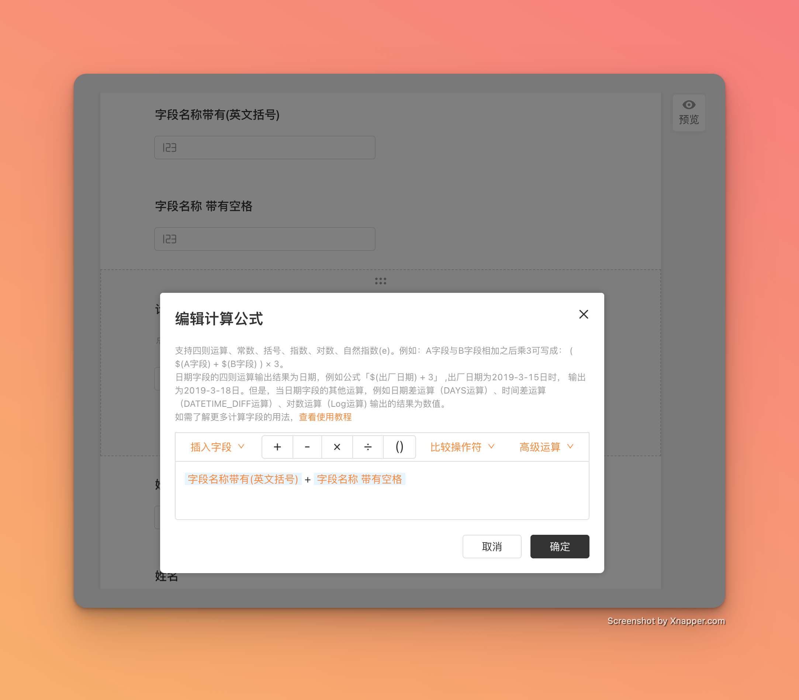
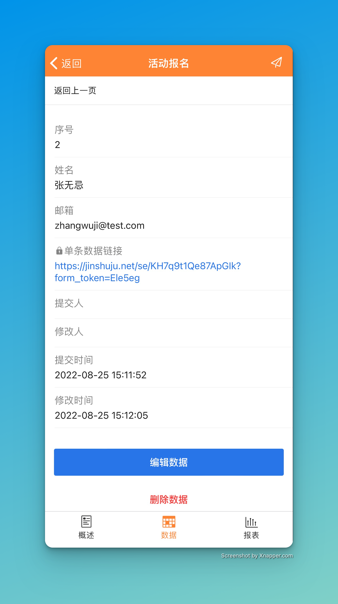
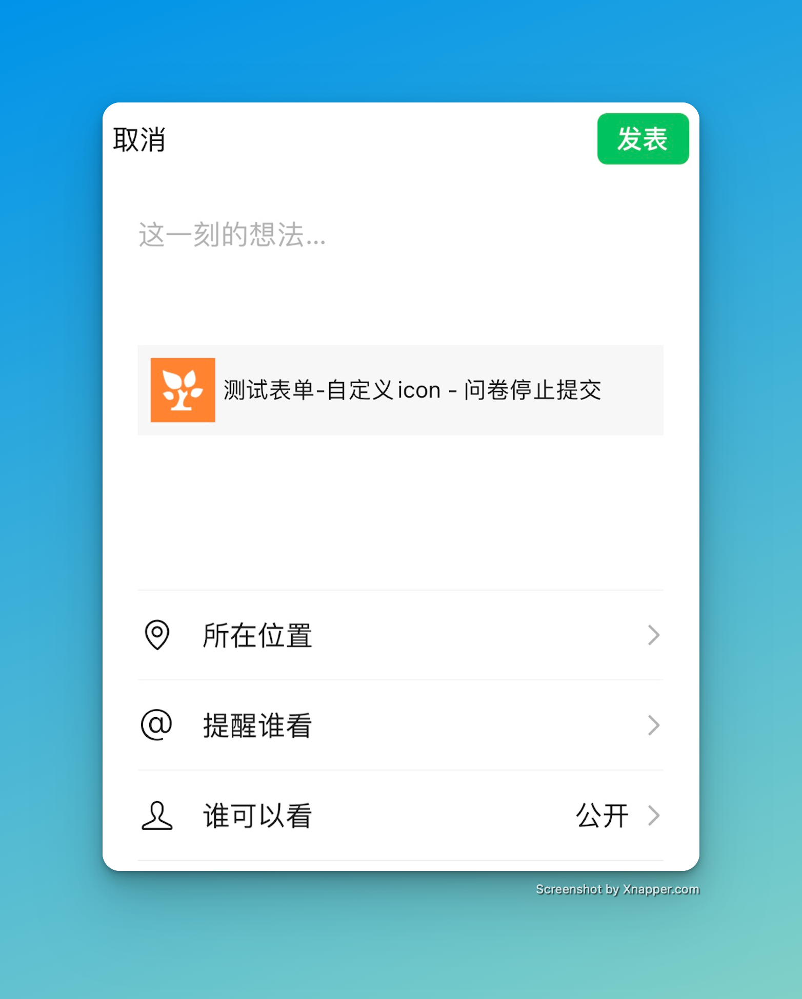
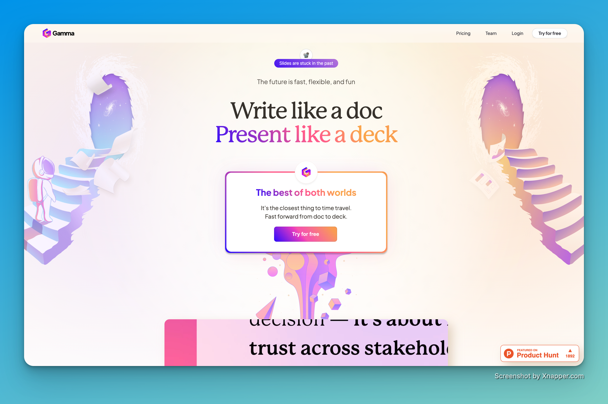

# 🧩 The Builder - issue #1

## 🎉 功能更新

### 🧮 作为表单管理员，我希望在计算字段里支持含有特殊字符名称的字段作为变量。

字段名称包含特殊字符，比如括号、空格等，也可以正常作为变量参与计算字段的计算了。

### 📱 作为表单管理员，我希望在手机上也可以看到数据的分享链接。

如果你分享了某一个数据给同事，现在在手机上也可以查看和分享这条数据的对外链接了。

### 🎁 作为表单管理员，我希望在微信分享关闭状态的表单也可以正常显示图标

如果你的表单尚未开放，或者已经关闭，现在在微信群或者朋友圈分享时，也会正常显示自定义图标了。

### 🪲 缺陷修复

* 当关联字段开启了微信扫码功能且表单开启了自定义域名，点击扫码会提示「扫描失败，请联系表单创建者」
* 预约字段中选项「超时」时却显示为「约满」
* 报表页面计算平均分的分母是「数据提交总数」，预期为「所有选项被选中次数总和」

## 🎈 The Topic

    每年开学季前夕
    除了熬夜赶作业的学生
    还有千千万万为开学做准备的
    教职工老师和学生组织等团体
    辛苦操持着开学各项事宜
    小金特此准备了
    #新学期必备攻略#
    希望能帮助大家效率up up up

点击访问：[开学指南——新学期必备攻略](https://jinshuju.net/f/ijf1jN)

或者扫描访问： 

## 💡 The Idea

本期分享的是 Seth Godin 的观点：

> We become creative when we ship the work

只有你真正去做的时候，你才能称为有创造力的。

而不是反着来的。

你是什么样子的人，是由你做的事情来决定的。

如果你想成为一个跑者，那就去跑步，坚持每天跑步，那你就是一个跑者了。

去做，去创造，然后你就是一个有创造力的人。

不要等待一个完美的时刻，也不要等待灵感的到来。很简单，去做，去创造，不断地重复这个过程。

[点击这里可以访问原文（英文）](https://sethgodinwrites.medium.com/we-become-creative-when-we-ship-the-work-71ebbc77d743)

## 🔑 The Tool

本期分享的是 https://gamma.app

> Write like a doc, Present like a deck

Gamma 是一个幻灯片工具（类似在线 PowerPoint）。不同于其他在线幻灯片工具的是，它是用写文档的方式来写幻灯片的，让你更加专注于内容而不是形式。你用 Gamma 写的幻灯片，既可以用来演示，也可以直接作为文档分享。
