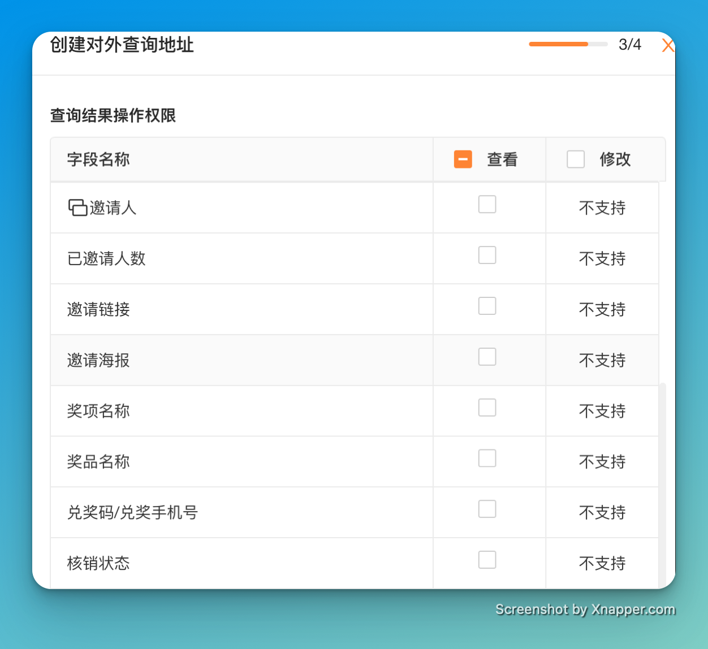
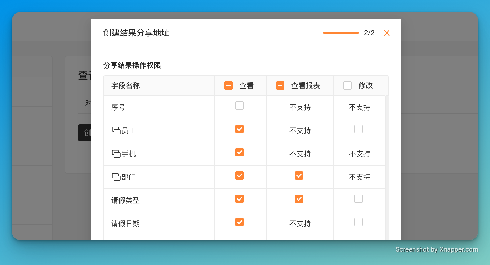
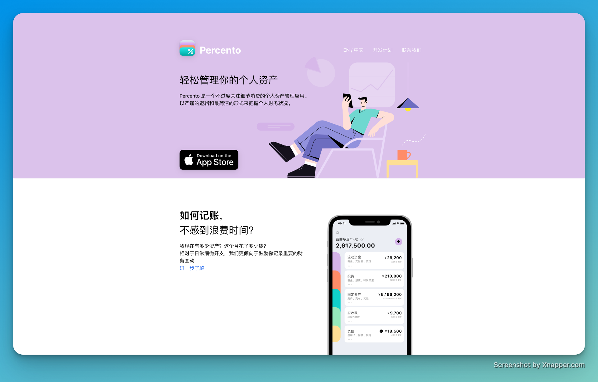

# 🧩 The Builder - issue #2

## 🎉 功能更新

### 🚀 作为表单管理员，我希望在对外查询和对外分享中，支持更多的系统字段

在表单的对外查询、对外分享、单条数据分享中，现在可以支持更多的系统字段了。

包括测评场景、数据裂变、表单红包、扩展属性、颜色标记、证书、幸运大转盘等功能相关的字段，都可以在对外查询、对外分享中配置了。

### 🖇 作为表单管理员，我希望在对外查询和对外分享中，支持单独配置表单关联的展示字段

使用了表单关联的表单，数据做对外分享或者对外查询时，在结果显示页面，可以单独给表单关联上的每一个展示字段配置权限了。这样子表单管理员可以更好的控制数据对外的展示权限。

### 🪲 优化和缺陷修复

* 设置了「提交按钮在手机浏览器中固定在屏幕底部」，预约场景表单，在移动端也能在表单底部固定提交按钮。
* 作为金数据用户，我希望申请开专票的时候，可以不填写营业执照副本。

## 💡 The Idea

本期分享的是 Naval Ravikant 的观点：

> Inspiration is perishable, act on it immediately.

灵感是易逝的，要立即行动。

当灵感来的时候可以立即采取行动，是很多人取得成功的关键因素。只有灵感和想法，或者是把灵感和想法记录到自己的 To-Do list 中，只会导致灵感逐渐消逝，最终毫无结果。

注：图片来自 visualizevalue.com

## 🔑 The Tool

本期分享的是 hhttps://www.percento.app

> 轻松管理你的个人资产

如果你希望记账，但是又不喜欢关注每一个交易细节，那可以试试 Percento。

Percento 不是那种记录每顿饭、每次购物详情的「记账」软件，你只需要关心你有多少资产，大头支出在哪里，从而更好的了解你的财务状况。

---

Cheers，下周见。

2022年8月29日
