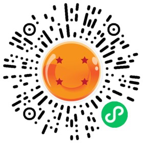

# 🧩 The Builder - issue #3

## 🎉 功能更新

### 🛴 在复制表单的时候，可以一并复制更多的表单设置了

如果你有一些复杂的表单，现在你复制这些表单时，可以将这些表单的设置项一并复制了。包括限制填写设置、提交后展示设置、开启状态设置等功能。这个更新会极大提升表单创建者的工作效率。

### 🛵 对外查询/对外分享的编辑数据按钮可以自定义文案了

当你对外分享表单数据，并且允许用户修改时，编辑数据的按钮可以自定义文案了。这个更新会让你的表单用户更好的理解按钮操作的预期行为，例如「修改我的预约记录」「更新防疫信息」，提升最终用户的点击率。

### 🚌 可以在客户管理模块中快速绑定表单了

在客户管理模块中，我们增加了「绑定群表单」的按钮。现在你可以的在客户管理中，给当前的客户群组绑定一个需要填写的表单了。这个更新也减少了原有的操作步骤，提升了工作效率。

### 🚗 缺陷修复与优化

* 在腾讯会议中使用金数据应用时，你可以更方便的绑定已有的金数据账号了。
* 表单数据导出为 SPSS 格式时，选项类的字段也可以按照赋值进行导出了。
* 修复了大批量发送邮件时，邮件发送状态没有及时更新的问题。

## 📜 The Idea

本期分享「BLUF 沟通技巧」

> BLUF - Bottom Line Up Front

BLUF 是用于军事的沟通技巧。它的方法很简单：先说最重要的事情。因为其他人可能没有时间看你的长词大论，毕竟在战场上，生死可能就发生在一瞬间。

在日常工作中，也可以使用 BLUF 技巧来写作和沟通。例如写自己的 blog、给团队汇报的邮件、和同事在聊天工具上沟通等场景。先简洁清晰的说出你的 Bottom Line，可能是你的决策、提议、计划等，然后再解释原因和补充上下文。

## 🌳 The Tool

本期分享的是 Forest App

Forest App 是一个手机应用，类似番茄时间管理，可以让用户更加专注于工作或学习。它的特点是开启专注后，App 会种一棵树苗，如果用户违反了规则使用手机，树苗就会死亡。

---

__扫码关注《金数据 The Builder》，每周第一时间得知金数据产品更新，以及有趣的想法和工具。__

The Builder

Cheers，下周见

2022年9月5日
