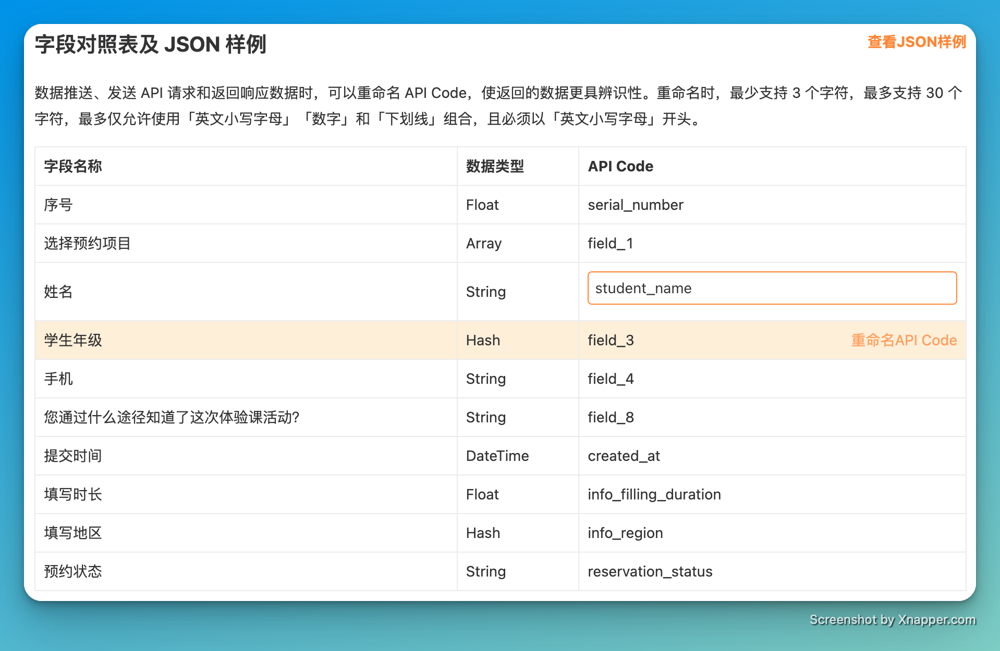
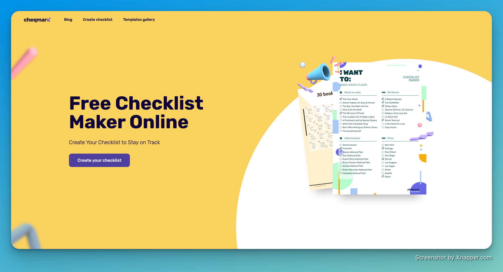

# 🧩 The Builder - issue #4

## 🎉 功能更新

### 🔌 你可以在 Webhook 推送/API 调用时，给表单字段自定义编码了

如果你需要将金数据表单和其他系统进行集成，无论是 Webhook 数据推送、还是 API 接口调用，现在都可以对表单字段进行自定义编码了。这样子你可以将金数据表单字段与你的系统字段名称进行匹配，也可以将多个不同的金数据表单的相同字段进行统一匹配。

例如，你可以将学生姓名字段从金数据生成的 `field_1` 自定义为 `student_name`。

### 🧹 缺陷修复与优化

* 调整了「电子签名」字段的按钮位置，以更适合用户的操作习惯。
* 完善了手机端管理数据时，对于「多字段表单关联」的支持。
* 修复了「表单仅限部分成员填写，变更群组出错」的问题。
* 更新了更多的表单样式。

## 🌠 The Idea

本期分享：

> Set goals. And work backwards.

设定目标。然后逆向工作。

中文可以叫做「以终为始」，类似的说法也有「亚马逊逆向工作法」（Working Backwards）。

## 📋 The Tool

本期分享的是 cheqmark.io

cheqmark.io 是一个在线应用，可以快速创建一个检查列表或者代办列表。无需注册即可使用。

---

__扫码关注《金数据 The Builder》，每周第一时间得知金数据产品更新，以及有趣的想法和工具。__

The Builder

Cheers，下周见

2022年9月12日 成都&西安
