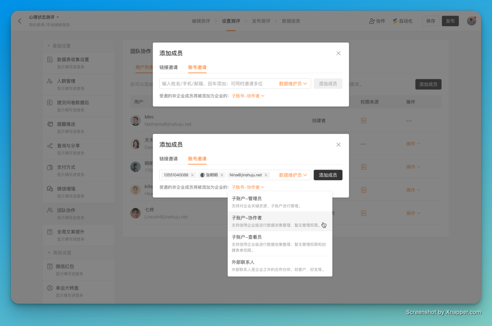
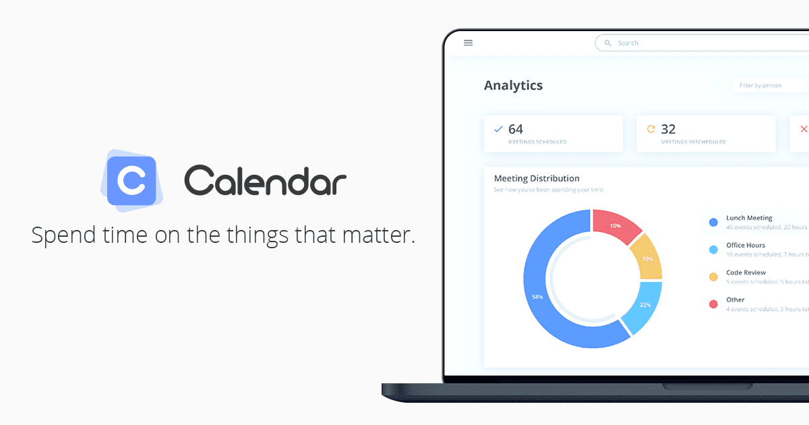

# 🧩 The Builder - issue #5

## 🎉 功能更新

### 👜 共享表单时，可以直接将协作者添加为企业子账号

子账号与团队协作是金数据企业版一个重要的功能。企业用户在使用金数据时，通过子账号，可以在团队成员间共享表单资源、控制更细化的权限。当你共享一个表单给同事时，你现在可以直接将对方邀请成为企业子账号了。对于有权限需求的用户，还可以给协作者配置基于表单字段、数据条件、操作类型各种维度的自定义权限。

### 🏌🏻‍♂️ 缺陷修复与优化

* 在企业设置的外部联系人页面，你可以一键将外部联系人转换为企业子账号了。
* 在企业设置的套餐用量页面，新增了申请购买附件包的表单。
* 优化了表单编辑器中的一些提示文案。

## 🎻 The Idea

本期分享：

> Continuous improvement requires feedback.

我们都希望可以持续地改进，不论是个人还是工作。使用「反馈」可以帮助我们建立一个持续的循环：Do - Feedback - Improve。

当然，你应该使用金数据来收集反馈。🎉🎉🎉

## 🎺 The Tool

本期分享的是 Calendar （ https://www.calendar.com ）

对，就是日历，但是更加高效，尤其是团队协作时。calendar.com 可以让团队之间共享日程，方便协作。并且 calendar.com 也提供了强大的分析能力，让用户可以看到自己的时间是如何分配的。

---

__扫码关注《金数据 The Builder》，每周第一时间得知金数据产品更新，以及有趣的想法和工具。__

The Builder

Cheers，下周见

2022年9月19日 成都&西安
