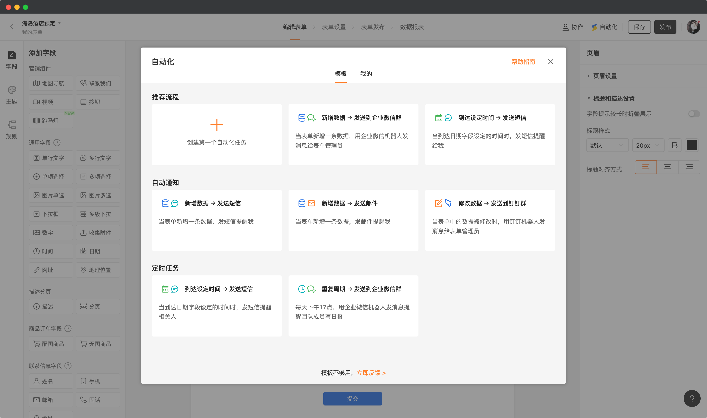
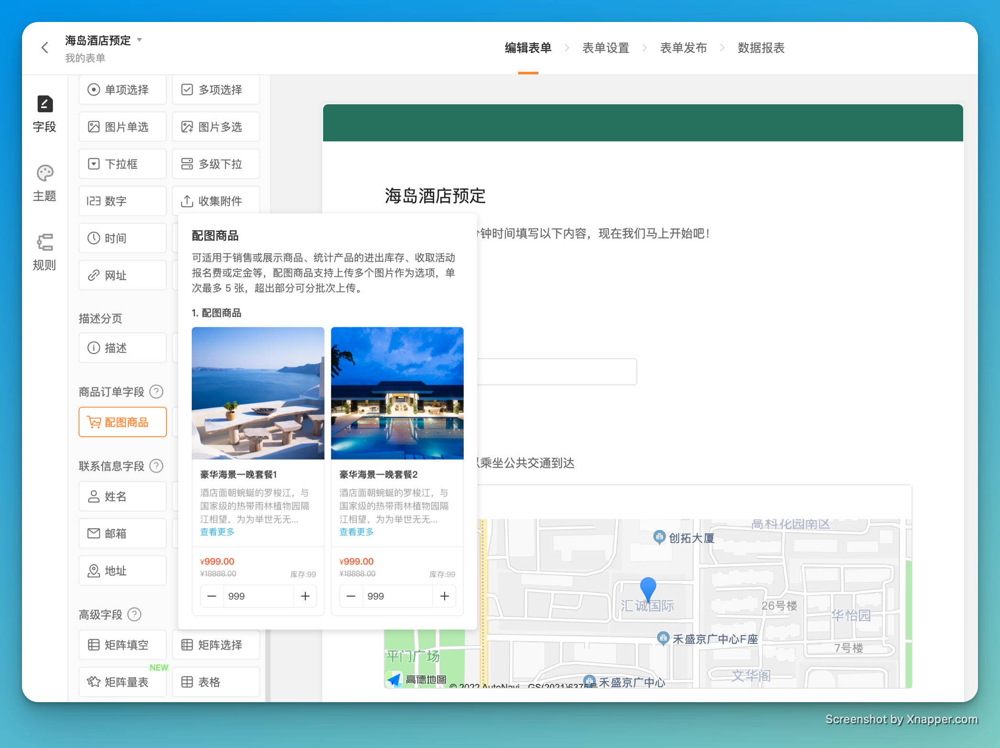
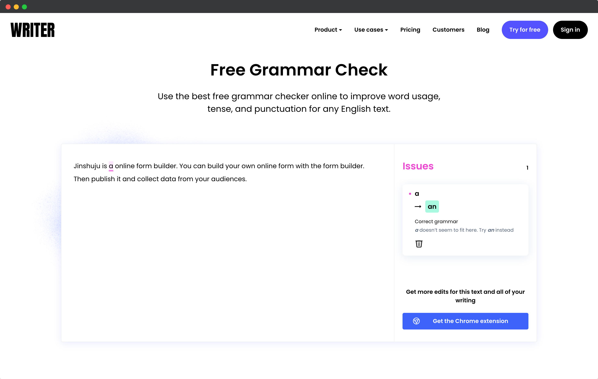

# 🧩 The Builder - issue #6

## 🎉 功能更新

### 👜 在创建表单自动化时，可以直接从模板中选择了

自动化是金数据表单的一个高级功能。使用自动化可以消息提醒、表单流程、数据协作等一些列事情。现在当你在表单上创建自动化时，系统可以自动根据表单的类型和相关字段，推荐一些常用的自动化模板了。

## 🏌🏻‍♂️ 缺陷修复与优化

* 在表单编辑器中，对每个字段组件添加了图文说明，以帮助用户理解。

* 「自定义打印」与「核销码」应用，支持了「横向填空」字段的展示。
* 优化了「自动化」和「提醒推送」中配置短信模板的文案。
* 开启了限填的表单，批量删除数据时，也会自动释放数据名额。
* 对于企业版用户，在对外表单领取红包时，不显示金数据的文案。

## 🎻 The Idea

本期分享：

> Eat the frog first!

马克吐温说过，如果你必须要吃一只青蛙，那么早上第一件事情就去吃那只青蛙。

「先吃青蛙」是一种优先级策略，可以提升工作的效率。这种策略是，先确认最具有挑战性的任务，并首先做那件事情。「先吃青蛙」确保了你每天只关心一件最重要的事情。当最重要的事情完成后，你就有剩余时间可以用来完成其他小的事情了。并且一般情况下，早晨也是你工作效率最高的时候。

## 🎺 The Tool

本期分享的是一款英文语法检查工具：

https://writer.com/grammar-checker

除了检查拼写错误外，writer 的 grammar checker 还可以检查语法。如果你需要写一些英文文章或者邮件，对自己英文语法不是那么有信心的话，这个工具可以帮你提升英文的质量。

---

__扫码关注《金数据 The Builder》，每周第一时间得知金数据产品更新，以及有趣的想法和工具。__

The Builder

Cheers，下周见

2022年9月26日 成都&西安
