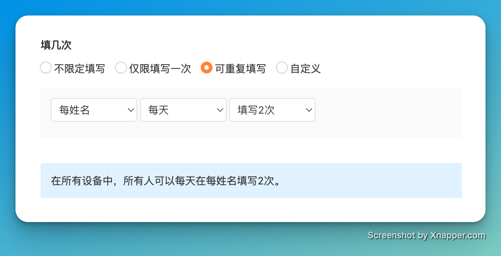
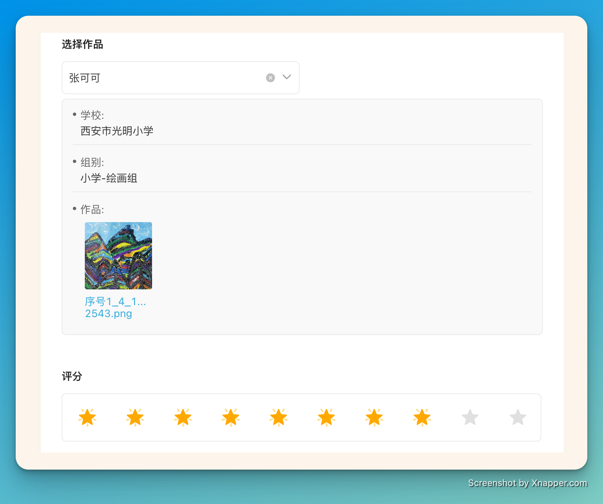
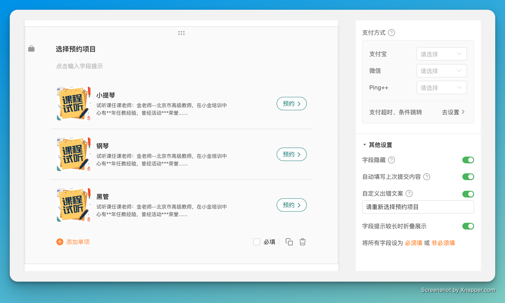
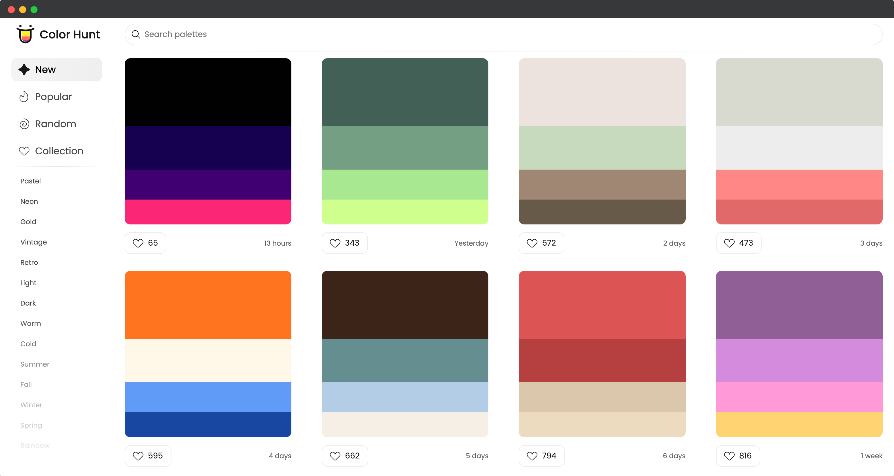

# 🧩 The Builder - issue #7

## 🎉 上周功能更新

### 🔐 表单填写规则，支持基于表单的字段来设置填写几次

在金数据的表单设置中，通过填写规则，你可以设置允许同一个填表人填写几次。除了根据 IP 地址、填写设备、微信 OpenID 等现有功能，现在你可以基于表单上的字段来配置规则了。

例如，如果你的表单上有手机号码或者学生姓名字段，那么你可以配置每个手机号码仅限填写一次，或者每个学生姓名限制每周填写5次等自定义规则。

这个功能配合金数据的 URL 传参会更加强大，这里举一个场景。

作为客户运营，需要给每个客户推送一份调研问卷，并限制每个客户只能填写一次。收集的问卷结果也需要知道对应的客户。这样的场景，你可以在金数据表单上添加一个「客户ID」字段。在向客户推送金数据表单链接时，通过 URL 传参，将已有系统里的「客户ID」传入到这个字段。最后，基于这个「客户ID」字段，在表单设置「每客户ID仅限填写一次」。这样子，当客户收到金数据表单链接后，提交的信息就会把客户ID自动保存到对应的字段。并且当提交后再次打开这个链接时，表单就会提示客户无法第二次提交。

关于金数据表单 URL 传参的功能，请访问 [金数据开放平台文档 - URL 传参](https://open.jinshuju.net/#/url_params/overview)

关于金数据表单填写规则的文档，请访问 [金数据帮助中心 - 表单填写状态和填写规则](https://jinshuju.net/help/articles/form-status-rules)

### 🎨 表单关联，可以展示关联数据中的图片文件、电子签名、配图商品等内容了

在表单关联中，如果关联的数据包含有「图片附件」、「电子签名」、「图片选项」、「配图商品」等字段，现在数据中包含的图片也会直接显示出来了。通过图片，可以让表单填写者更明确所选择的数据。例如，在学校选课时选择课程，就显示老师头像；或者美术比赛对作品打分时，选择参赛记录就显示参赛者作品图片等。

关于金数据表单关联，请访问 [金数据帮助中心 - 表单关联](https://jinshuju.net/help/articles/form-association) 了解更多

### 📆 预约字段支持更多的其他设置了

预约字段集成了日历时间、项目选择、报名数量等，很多金数据用户都是用预约字段来完成自己的在线业务。现在，预约字段支持了更多的「其他设置」选项，包括「字段隐藏」「自动填写上次提交内容」「字段提示较长时折叠展示」等功能。

## 🩹 缺陷修复与优化

* 证书中插入的字段，调整为默认居中显示文字。
* 有填写项的表单，也可以隐藏「提交」按钮了。
* 预约、考试测评、收款等场景的表单，也可以隐藏「提交」按钮。
* 优化了考试测评场景，对外查询修改数据中，不应该支持对题型字段的修改。
* 修复了自动化短信任务中，交易状态变量未能正常显示的问题。
* 修复了幸运大转盘应用，设置手机号为兑奖方式，在对外查询页面未能正常显示的问题。

## 💡 The Idea

> JOMO - Joy of Missing Out

JOMO 是英文 Joy of Missing Out 的缩略语，意为「错失的乐趣」，指因为不再害怕错过别人做的事情或说的话而体会到的愉悦。

与其对应的是 FOMO - Fear of Missing Out，指的是一种患得患失所产生的持续性焦虑，通俗点讲就是怕错过。

## 🚀 The Tool

本期分享的是一个在线颜色生成器

https://colorhunt.co

Color Hunt 可以随机生成一些搭配好的颜色组合，你可以用在自己的网站、PPT 等内容上。你还可以根据关键词来搜索颜色组合，例如热情、复古、日落等。

---

__扫码关注《金数据 The Builder》，每周第一时间得知金数据产品更新，以及有趣的想法和工具。__

The Builder

Cheers，下周见

2022年10月10日 成都&西安
