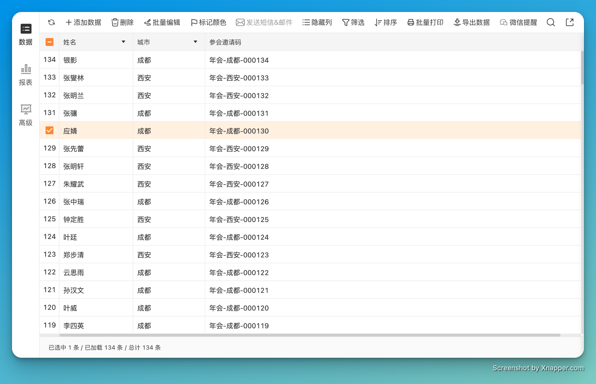

# 🧩 金数据产品每周更新 The Builder - issue #8

## 🎉 上周功能更新

### 🎫 Excel 导入数据，可以批量生成自定义规则确认码了

自定义规则确认码，是金数据一个很强大的功能。你可以配置规则，给每条数据生成一个唯一的符合业务需求的编码。确认码可以用在报名预约、福利申请、数据核销等很多业务场景。

现在，在系统后台通过 Excel 上传已有数据，也可以批量生成自定义规则确认码了。如果你已经有了一批客户，可以通过这种方式先生成确认码。生成之后，你可以通过短信邮件的方式将确认码推送给客户。你可以通过表单关联、对外查询等方式将确认码与其他表单业务集成起来。

更多关于金数据确认码的功能，请[访问帮助中心文章](https://jinshuju.net/help/articles/generate-code)

### 📆 优化了「日期」字段作为数据筛选条件的使用

日期字段是业务中使用频率很高的一个字段。现在你可以更高效的使用日期字段来筛选过滤数据量。你可以在自定义角色的权限设置里，限制协作者只能看到部分日期的数据。也可以在对外查询、对外分享、表单关联、自动化触发条件中，限制只满足特定日期条件的数据。除了表单中的日期字段，数据提交日期等系统字段也可以用在这些场景中。

## 🪲 其他优化和修复

* 优化了用户表单量非常多时，部分操作的性能问题。
* 修复了地址字段，仅选择省市时，在数据页面的显示问题。
