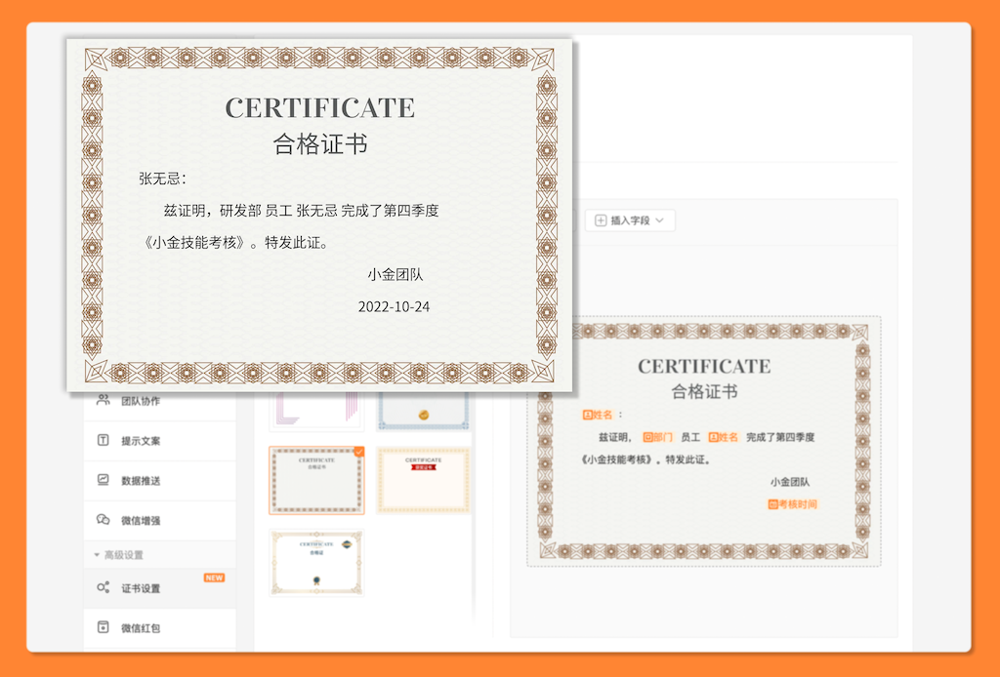

# 🧩 金数据产品每周更新 The Builder - 第9期

## 🎉 上周功能更新

### 🎫 在表单生成证书时，可以使用集成的客户信息字段作为证书文案变量了

证书和客户管理是金数据非常强大的两个功能，现在你可以将两者结合起来了。

利用证书，你可以在填表人提交表单后，给填表人生成考试测评结果、考核证书、信息登记凭证等功能。而利用客户管理，你可以将你的学员、客户、员工信息与表单关联和管理起来。

例如，现在你可以将你的员工作为一个群组。员工可以一次录入个人信息，通过一个统一的门户登录访问表单。每次填写和提交表单，就无需再次重复录入个人信息。在使用证书模块时，在证书的自定义文案里，可以直接使用员工的个人信息，例如姓名、部门等数据，作为证书的变量。生成的证书就会自动包含这些员工信息了。

## 优化和缺陷修复

* 修复了在 iframe 中嵌入分页式表单的样式问题。
* 修复了 URL 传参中，部分特殊字符没有正确传入金数据表单的问题。
* 在团队协作中，搜索协作者时，会自动忽略邮箱的大小写。

## 🍜 The Idea

## 🍽 The Tool

