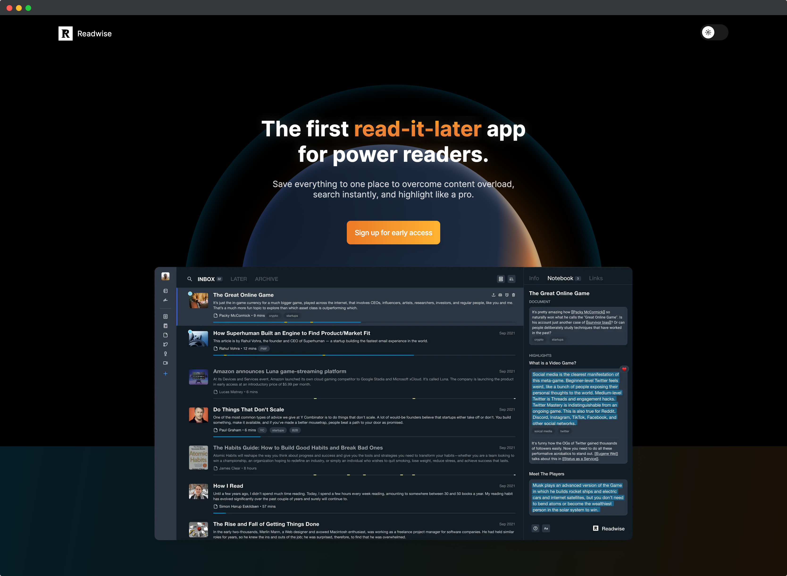

# 🧩 金数据产品每周更新 The Builder - 第9期

## 🎉 上周功能更新

### 🎫 在表单生成证书时，可以使用集成的客户信息字段作为证书文案变量了

证书和客户管理是金数据非常强大的两个功能，现在你可以将两者结合起来了。

利用证书，你可以在填表人提交表单后，给填表人生成考试测评结果、考核证书、信息登记凭证等功能。而利用客户管理，你可以将你的学员、客户、员工信息与表单关联和管理起来。

例如，现在你可以将你的员工作为一个群组。员工可以一次录入个人信息，通过一个统一的门户登录访问表单。每次填写和提交表单，就无需再次重复录入个人信息。在使用证书模块时，在证书的自定义文案里，可以直接使用员工的个人信息，例如姓名、部门等数据，作为证书的变量。生成的证书就会自动包含这些员工信息了。

## 优化和缺陷修复

* 修复了在 iframe 中嵌入分页式表单的样式问题。
* 修复了 URL 传参中，部分特殊字符没有正确传入金数据表单的问题。
* 在团队协作中，搜索协作者时，会自动忽略邮箱的大小写。

## 🍜 The Idea

> 每个人都需要一个董事会

为了保持高标准，你需要一个强制功能，你需要一个理由。这就是为什么即使是创办第四或第五家公司的创业者，也应该有一个董事会。他们的董事会应该有一些非常聪明和意志坚强的人，这些人会和创业者争论，而不是亲力亲为。大多数人需要一些强迫的机制，他们需要被迫充分思考问题，他们需要被迫去做所有的工作，他们需要被迫捍卫它。如果没有人逼他们，他们就会变成自满和懒惰，他们变得傲慢，变得非常具有破坏性。这时做什么都无济于事了。

分享自[《做自己的董事会》](https://mp.weixin.qq.com/s/ZfmPzm4ScT3MKR22GYQE-w)

## 🍽 The Tool

本期分享的是一款阅读App。

https://readwise.io/read

如果你平常喜欢在网上阅读文章，订阅邮件、newsletter，那么 readwise read 这款 App 就将非常适合你。目前这个 App 还在内测中，需要在官网上申请试用。

---

__[点击这里免费注册金数据](https://jinshuju.net/?utm_campaign=the_builder&utm_medium=social&utm_source=github)，搭建你的业务数据收集管理系统！__

__扫码关注《金数据 The Builder》，每周第一时间得知金数据产品更新，以及有趣的想法和工具。__

The Builder

Cheers，下周见

2022年10月24日 成都&西安
