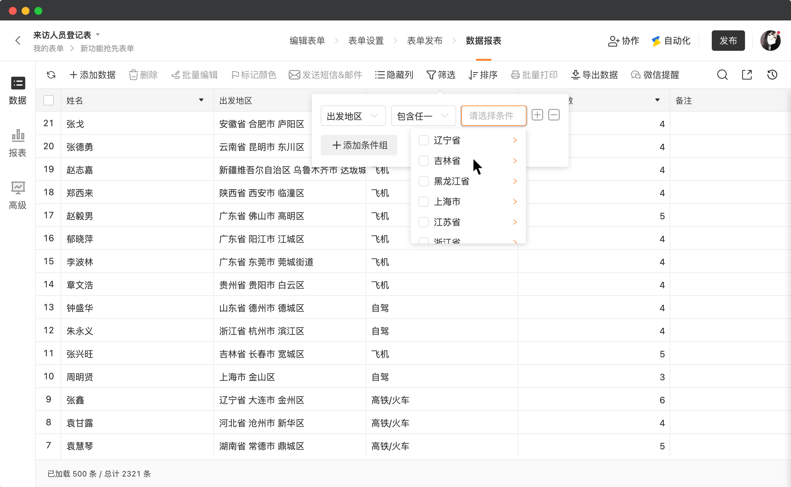

# 🧩 金数据产品每周更新 The Builder - 第10期

## 🎉 上周功能更新

### 数据筛选过滤时，地址字段也可以使用「包含任一」「不包含任一」了

数据筛选、设置符合条件的数据、根据数据限定权限，一直是金数据的一个重要的功能。我们已经对各种字段可以支持的筛选条件进行了优化。对于地址字段，现在你也可以使用「包含任一」「不包含任一」对多个地址进行筛选过滤了。

例如，你可以对表单配置一个自动化通知。只有当来访人员的出发地，是多个限定地址中的任何一个时，给企业微信发送特定的消息通知。

除了地址字段以外，文本、数字、日期、选项类字段，都已经支持了「等于」「不等于」「大于」「小于」「包含」「为空」等等一系列的筛选条件。现在就访问表单的数据页面来试试吧。

## ⛳️ 优化和缺陷修复

* 对企业版用户，优化了表单底部自定义 Logo 和文案的样式，更突出表单的品牌。
* 改进了表单在 PC 和移动端展示时的圆角。
* 矩阵选择字段也可以添加其他选项了。
* 修复了字段选项文本过长时，在部分页面的显示问题。
