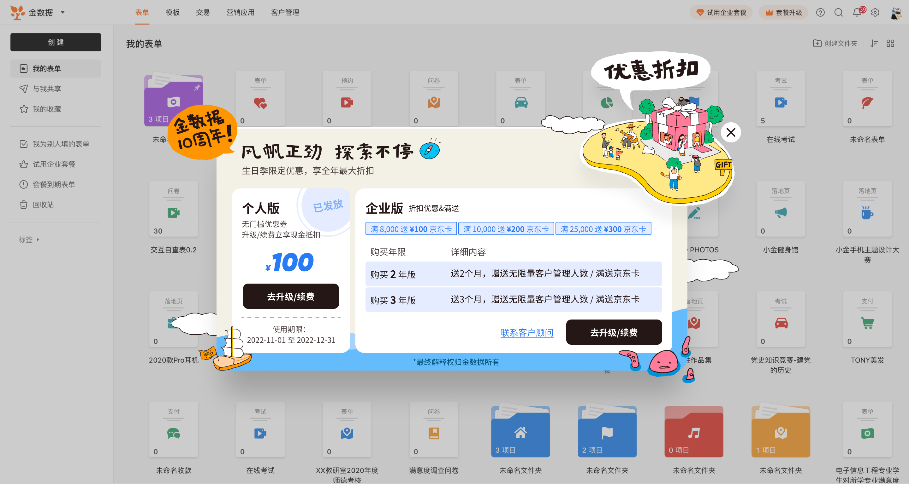
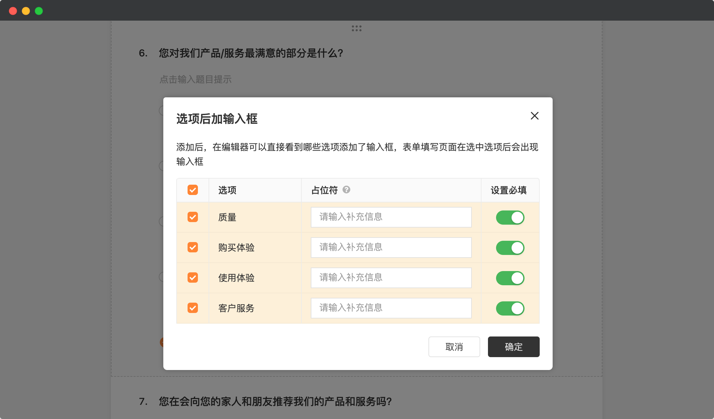
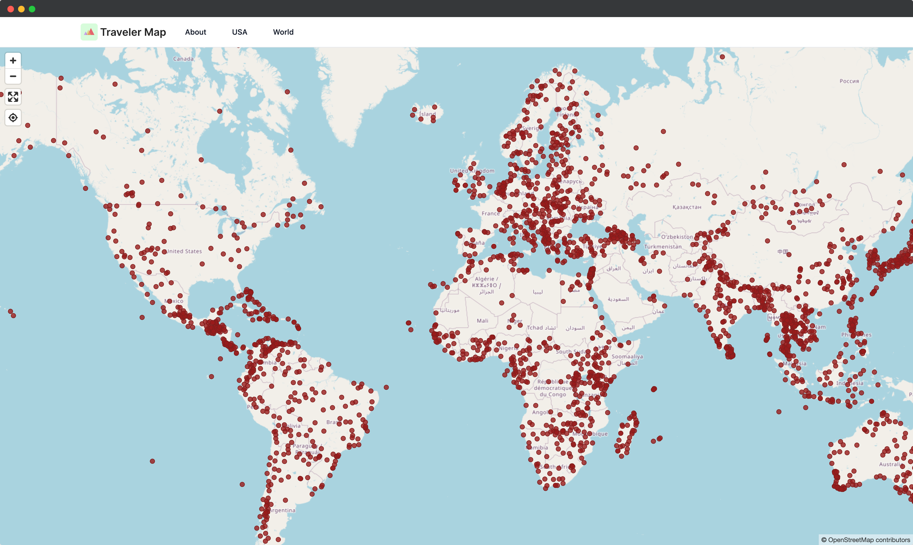

# 🧩 金数据产品每周更新 The Builder - 第11期

## 🎉 上周功能更新

### 🎁 金数据 10 周年优惠大促~

为了庆祝金数据 10 周年生日，本月我们开启了金数据 10 周年的优惠大促。个人版、企业版均有福利多多。

现在就登录金数据网站，领取优惠。

### 📝 选项后加输入框，现在可以设置为必填了

收集数据时，对于数据完整性的校验很重要。金数据可以对表单上的每个字段或者题目设置必填。

对于选项类字段，你可以给选项设置一个输入框，当填表人选择了这个选项时，可以通过这个输入框录入一些补充信息。例如一个产品调研问卷，当用户选择了对产品哪部分最满意后，可以通过额外的输入框追问用户选择的原因。

现在对于题目本身、其他选项、每个选项后的输入框，你都可以设置为必须填写了。

## 🎠 优化和缺陷修复

* 在金数据充值、购买短信包、邮件包、附件包时，可以自定义购买的数量了，以满足于用户自己的实际需要。
* 客户管理中，优化了填表人查看自己已经填写过的数据页面，调整了部分系统字段的显示逻辑。
* 随机出题的考试测评表单，填表人登录客户管理后，只能看到自己随机到的题目。

## ⚾️ The Idea

> 你的每一个行动，都是对你想成为怎样的人的投票。

## 🎾 The Tool

本期分享的是一个「云旅行」工具 https://travelermap.net/

在 travelermap.net 可以查看世界各地的国家公园。

---

__[点击这里免费注册金数据](https://jinshuju.net/?utm_campaign=the_builder&utm_medium=social&utm_source=github)，搭建你的业务数据收集管理系统！__

__扫码关注《金数据 The Builder》，每周第一时间得知金数据产品更新，以及有趣的想法和工具。__

The Builder

Cheers，下周见

2022年11月7日 成都&西安
