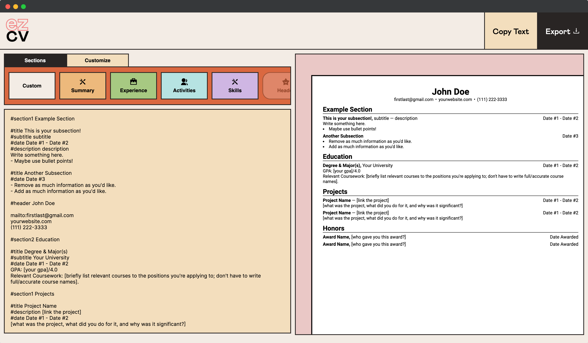

# 🧩 金数据产品每周更新 The Builder - 第12期

## 🎉 上周功能更新

### ⏰ 可以基于预约组件的时间，给预约者发送短信邮件提醒了

预约组件是金数据一个特色功能。通过预约组件，你可以配置公司对外提供的服务项目，并设置可选的时间段与名额。你的客户可以直接通过一个日历组件来进行选择，已完成对服务的预约。

现在你可以基于预约记录的日期时间，来设置自动化的消息提醒了。

例如，你可以设置当每条预约记录的时间前一个小时，给预约者的手机号推送短信提醒。这样子就可以避免预约者错过了时间。

除了提前小时外，你可以灵活的按月、天等时间进行设置。推送提醒的内容也可以自定义短信、邮件。你也可以通过自动化将数据推送到你的其他 IT 系统已达到数据间的集成。

[点击这里查看](https://jinshuju.net/help/articles/appoint) 金数据预约组件的视频介绍

[点击这里查看](https://jinshuju.net/help/articles/automation) 金数据自动化功能

## 🦋 优化和缺陷修复

* 考试场景中，考试答案的判定兼容了输入法的全角和半角字符。
* 使用微信 OpenID 关联表单数据时，修复了对于图片类数据显示的问题。
* 修复在钉钉中查看表单填写回收率的显示问题。

## ⚾️ The Idea

> 5分钟法则

5分钟法则是一种认知行为技术，可以帮助你克服拖延症，提升工作效率。

简单来讲，你需要先承诺只花5分钟来处理你一直拖延的事情，你可以之后立即停止。大多数情况下，人们在5分钟后都会继续工作。因为你已经克服了最重要的障碍。

## 🎾 The Tool

本期分享的是一个简历制作工具 https://www.ezcv.pro/builder

比较简单也比较有趣，可以做出简洁漂亮的个人简历。

---

__[点击这里免费注册金数据](https://jinshuju.net/?utm_campaign=the_builder&utm_medium=social&utm_source=github)，搭建你的业务数据收集管理系统！__

__扫码关注《金数据 The Builder》，每周第一时间得知金数据产品更新，以及有趣的想法和工具。__

The Builder

Cheers，下周见

2022年11月14日 成都&西安
