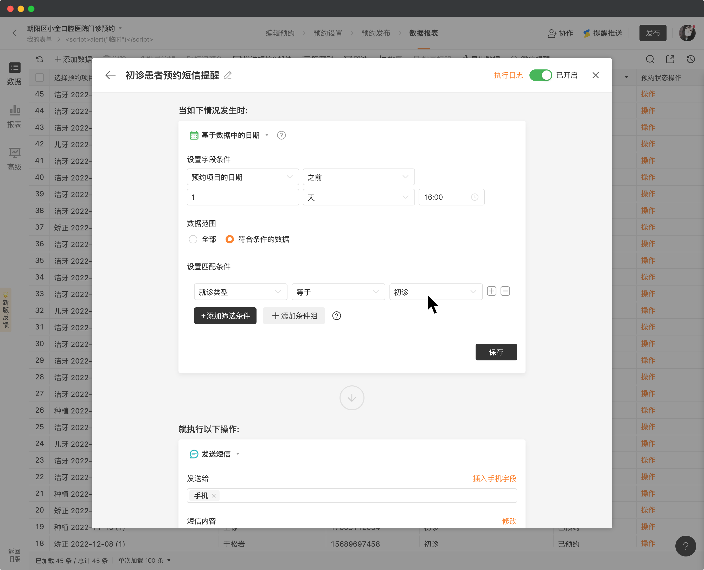

# 🧩 金数据产品每周更新 The Builder - 第13期

## 🎉 上周功能更新

### 📆 基于表单数据中的日期设定的自动化事件，可以限定触发的数据范围了

日期和时间是很多表单上非常重要的一个数据，例如预约场景中的预约时间、活动报名的日期、客户或者员工的生日等等信息。在金数据的自动化消息提醒中，你可以通过数据上的时间来配置对内对外的消息提醒。例如预约时间之前一个小时给客户发送短信提醒，每年在客户生日当天给客户发送生日祝福短信等。

现在你可以在配置基于日期时间的自动化时，使用表单字段来限定数据范围了。

例如，在推送预约提醒时，可以限定只给预约状态是审核通过的发送。或者在客户信息表上，设置只给 VIP 客户发送生日祝福短信等。

[点击这里](https://jinshuju.net/help/articles/automation) 查看更多金数据自动化的帮助文档。

### 📱 文本、数字类型的字段，可以切换为手机字段了

在金数据表单上，手机类型的字段具体特殊的业务功能。例如在填表页面，可以配置通过短信验证码，来确保收集到的手机号码的真实性。在后台数据管理页面，也可以使用手机号码来发送自定义短信，或者使用手机号码作为客户信息的标识符。

有时候，我们已经使用文本类型或者数字类型收集到了一些数据。此时，如果你像使用手机相关的业务功能，现在就可以很容易的在表单编辑器里将他们转换为手机类型的字段的。符合手机格式的数据，都会自动识别为手机号码，以便于你后续的使用。

[点击这里](https://jinshuju.net/help/articles/phone) 查看更多金数据手机字段的帮助文档。

## 🎊 优化和缺陷修复

* 在表单提交后跳转网页的链接上，也可以使用自定义的 API Code 来和你的系统进行集成了。
* 金数据钉钉版，现在支持了非管理员升级套餐了。
* 优化了编辑器中表单选项数量过大时，保存表单的性能问题。
