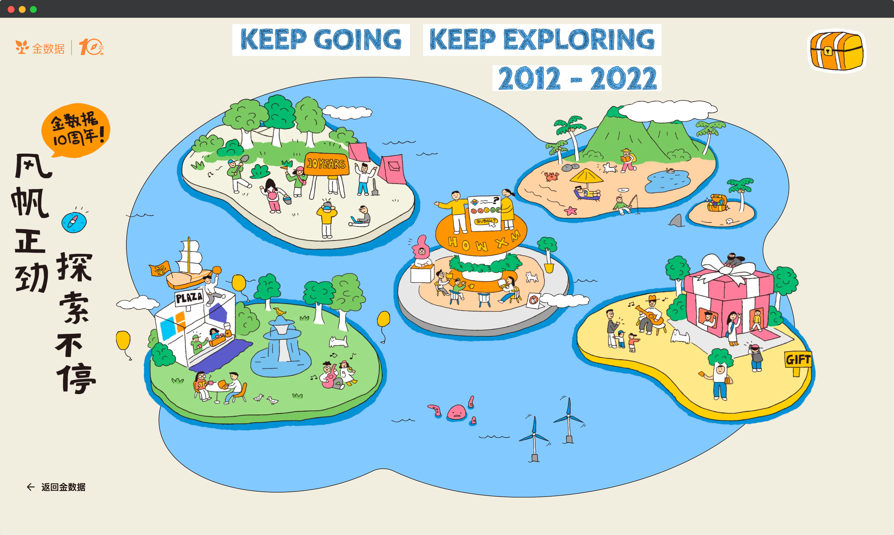
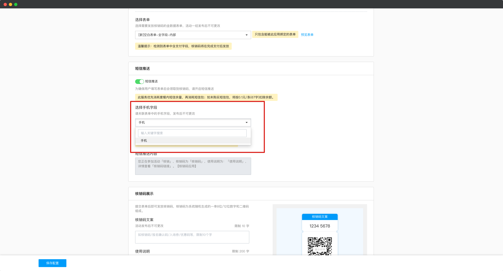
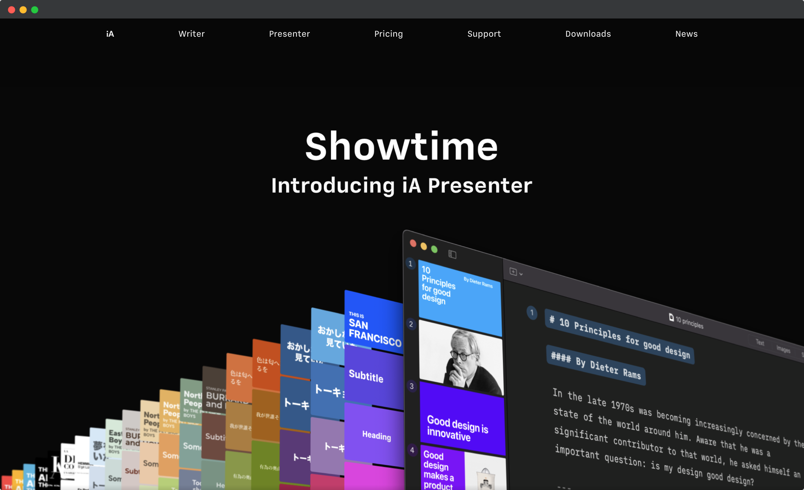

# 🧩 金数据产品每周更新 The Builder - 第14期

## 🎉 上周功能更新

### 🎂 金数据 10 周年活动开始了

金数据 10 周年生日，我们修了一座岛，[点击立刻上岛](https://jinshuju.net/10)，集徽章抽大奖。

### 📱 核销码应用支持选择关联表单的手机字段作为短信接受者

核销码是金数据一个很实用的应用。用户提交表单后，可以获取到一个唯一的核销码，方便线上转线下活动时，作为提交数据的凭证。例如在活动报名、预约中都可以使用。在提交数据时，也可以通过短信的方式将核销码推送给填表人。

现在核销码可以直接使用表单关联的手机数据了。这样子如果已经有了填表人的手机信息，就不需要填表人重复录入。

[更多关于核销码的帮助文档](https://jinshuju.net/help/articles/code-verify)

[更多关于表单关联的帮助文档](https://jinshuju.net/help/articles/form-association)

## 🎊 优化和缺陷修复

* Excel 导入数据，现在支持地址字段了。
* 使用表单关联时，现在最多可以支持 20 个展示字段，可以更灵活的搭建业务场景。
* 表单删除后，管理员可以在回收站中彻底删除表单。
* 分页式表单也支持了「网址」字段了。

## ⚾️ The Idea

> Take on less, accomplish more.

承担更少，成就更大。

成功并不是来自于承担所有的任务。它来自于专注，深深地专注于真正重要的任务。对重要的事情说「是」，对不重要的事情说「不」。你的时间是非常珍贵的资产。

## 🎾 The Tool

本期分享的是一个类 PPT 工具：iA Presenter https://ia.net/presenter

它是由 iA Writer 出品的，目前仍在邀请测试阶段。和普通的 PPT 工具不同的时，iA Presenter 让作者更关注在内容的创作上，只需要按照文档来写你的故事就可以创作出精美的 PPT 了。

---

__[点击这里免费注册金数据](https://jinshuju.net/?utm_campaign=the_builder&utm_medium=social&utm_source=github)，搭建你的业务数据收集管理系统！__

__扫码关注《金数据 The Builder》，每周第一时间得知金数据产品更新，以及有趣的想法和工具。__

The Builder

Cheers，下周见

2022年12月05日 成都&西安
