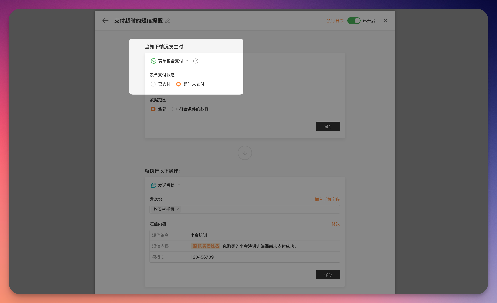

# 🧩 金数据产品每周更新 The Builder - 第15期

## 🎉 上周功能更新

### 💰 包含支付的表单，可以在支付未成功时触发自动化任务了

金数据表单支持微信支付和支付宝，可以实现报名收费、在线收款、商品订单等业务。

含有支付的表单，会支持「支付成功」和「支付超时」两个自动化触发器。你可以使用这两个触发器来实现业务流程的自动化。例如，当表单支付成功时，给填表人推送活动的具体信息，用来提醒填表人参加活动。或者，你也可以在支付未成功时（超时未完成支付），给填表人推送消息，以便引导填表人重新填写并完成支付。

[点击这里](https://jinshuju.net/help/articles/goods-field) 查看更多金数据商品字段的文档。

[点击这里](https://jinshuju.net/help/articles/automation) 查看更多金数据自动化的文档。

### 在线考试

在线考试是金数据非常受欢迎的一个场景。你可以通过在线考试来进行技术测评、知识竞赛等业务。

参加考试的填表人提交考卷后，可以设置是否允许填表人查看成绩和答案解析。现在填表人可以选择只看答错的题目，提升了考试测评的效率。

[点击这里](https://jinshuju.net/help/articles/scene#part-6542e63dedc) 查看更多金数据在线考试和更多场景。

## 🎊 优化和缺陷修复

* 打印数据时，支持矩阵填空中的图片附件。
* 在数据推送设置页面的字段对应表中，完善了对系统字段的支持。
* 当字段被删除时，可以明确显示被影响到的自动化任务。

## ⚾️ The Idea

> 更多的信息不会帮你做出正确的判断

有一个关于赛马的数据统计，让一个记者来预测赛马的结果。假设比赛有 10 匹赛马，如果记者没有任何信息，那么他预测的正确率会是 10%。如果给记者提供 10 条信息，那么他预测的正确率将会提升至 17%。但是如果再提供更多的信息，比如 30 条信息、50 条信息，都不会对最后的预测成功率产生太多的改变。

## 🎾 The Tool

本期分享的是一个小工具，可以生成三角拼接的背景图片 https://trianglify.io/

功能比较简单和直观，可以自定义各种颜色和拼接规则。

---

__[点击这里免费注册金数据](https://jinshuju.net/?utm_campaign=the_builder&utm_medium=social&utm_source=github)，搭建你的业务数据收集管理系统！__

__扫码关注《金数据 The Builder》，每周第一时间得知金数据产品更新，以及有趣的想法和工具。__

The Builder

Cheers，下周见

2022年12月19日 成都&西安
