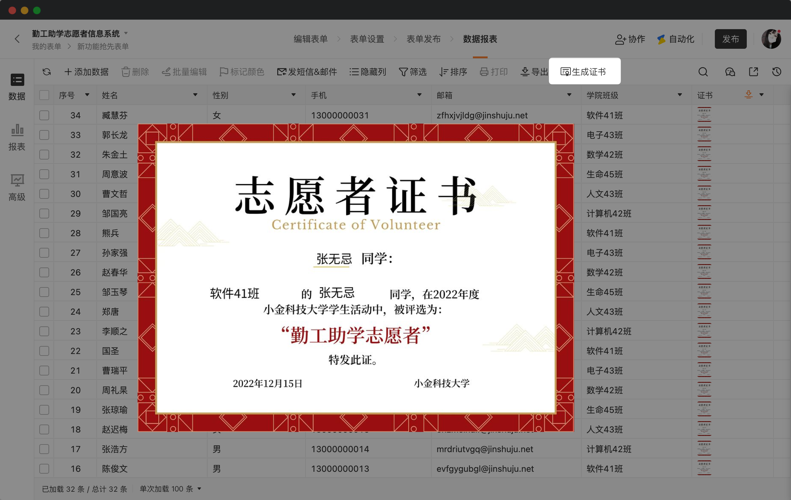

# 🧩 金数据产品每周更新 The Builder - 第16期

## 🎉 上周功能更新

### 在系统后台，你可以针对导入的数据或者已经收集到的数据手工生成证书了

金数据的证书功能可以用于考试测评、活动报名等业务场景。你可以给考试合格的同学发放资质证书，也可以给参与活动成功的同学发放凭证证书。

有很多业务场景，是需要在系统后台来手工生成证书的。例如志愿者报名需要审核，对于提交的所有数据，表单管理员可以在系统后台审核，进对于资质审核通过的报名者发放证书。或者报考信息，管理员可以在后台通过 Excel 将考生信息上传，然后批量生成准考证证件。

所有手工生成的证书，都可以通过附件打包的方式下载。你也可以创建一个对外查询，让考生或者活动报名者自己查询证书结果。或者通过自动化的方式将证书信息推送出去。

## 🎊 优化和缺陷修复

* 「确认码的自定义规则」支持「表单关联字段和客户信息字段」中包含的简单字段。
* 使用双向关联时，当展示字段内容过长时，在数据详情做了显示上的优化。
* 创建短信模板时上传资质证明与提审备注必填，并能上传多个资质证明。
* 表单定向发送或一键催发之后，在系统内均能查询到日志，以便后续追溯和查询。
* 对外查询页面，如果表格字段中包含链接，可以打开网址了。

## ⚾️ The Idea

> 可逆决策和不可逆决策

可逆决策作出后，是可以改变并且回到决策之前的状态的。不可能决策作出后，就无法再退回到之前的状态。对于可逆决策，最大的风险是犹豫不决，我们应该尽快做出决定。对于不可逆决策，最大的风险是做出了错误的决定，所以要更加谨慎，花些时间来减少不确定性。

## 🎾 The Tool

本期分享的是一个小工具，可以快速创建产品的落地页： https://earlybird.im/

earlybird.im 本身也是刚刚在圣诞节发布，目前比较简单易用。你可以在产品早期的阶段，先创建落地页来吸引用户，以及验证你的产品。

---

__[点击这里免费注册金数据](https://jinshuju.net/?utm_campaign=the_builder&utm_medium=social&utm_source=github)，搭建你的业务数据收集管理系统！__

__扫码关注《金数据 The Builder》，每周第一时间得知金数据产品更新，以及有趣的想法和工具。__

The Builder

Cheers，下周见

2022年12月26日 成都&西安
