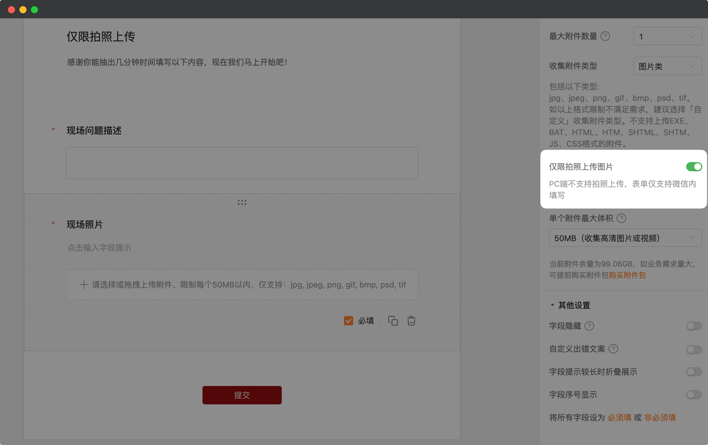
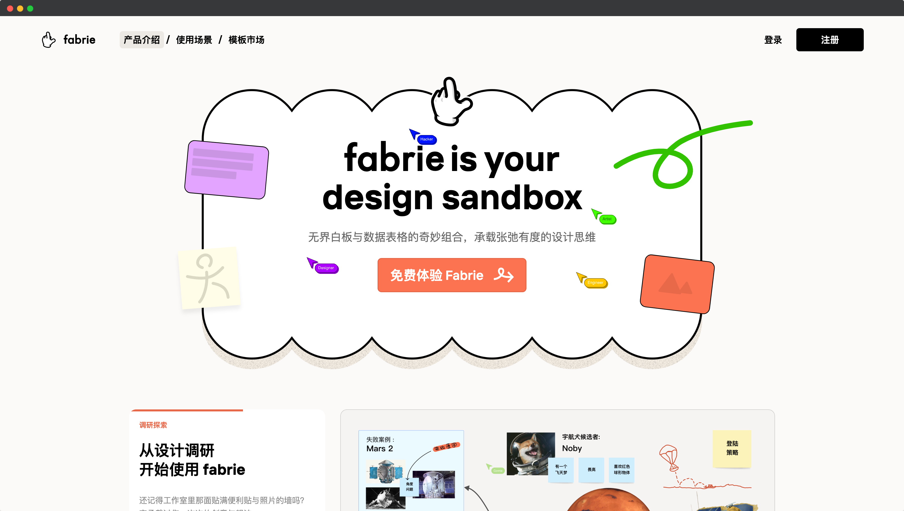

# 🧩 金数据产品每周更新 The Builder - 第17期

## 🎉 上周功能更新

### 📸 收集附件表单，可以限定只允许填写者拍照上传图片

金数据表单支持「收集附件」功能，你可以让填表人上传照片、视频或者任何文档。

对于有些业务来讲，需要限制填表人只能拍照上传图片，例如物业打卡、业务员巡检、现场举报等。现在，你可以在「收集附件」字段上开启「仅限拍照上传图片」，以保证收集到的图片一定是现场照片了。

[点击这里](https://jinshuju.net/help/articles/upload-file) 查看更多金数据收集附件字段的文档。

## 🎁 功能优化

* 通过 Excel 导入数据时，支持「时间」字段的导入了。
* 在数据页面，选项类字段可以根据选项标题进行排序了。
* 在数据页面，可以隐藏「序号」字段，以方便显示更多信息。
* 绑定了群组限填的在线考试表单，也可以设置提交后是否展示「返回群组」的按钮了。

## 🍰 The Idea

> 反向思考：避免愚蠢比寻求辉煌更容易。

仅从一个方向思考问题是不够的，你需要向前和向后两个方向同时思考。反向思考会让你发现试图解决的问题的隐藏信息。举个例子，加入你想提升组织的创新能力。正向思考，你可能会想到很多事情来促进创新。然而，如果你反向思考这个问题，现在组织里有什么事情是在阻碍创新的吗？这样子会更简单，只需要避免这些事情就可以了。

## 🍽 The Tool

本期分享的是一个设计师在线协作平台： https://www.fabrie.cn

www.fabrie.cn 集成了在线白板和在线表格的功能，可以让设计师协同完成设计探索的工作。

---

__[点击这里免费注册金数据](https://jinshuju.net/?utm_campaign=the_builder&utm_medium=social&utm_source=github)，搭建你的业务数据收集管理系统！__

__扫码关注《金数据 The Builder》，每周第一时间得知金数据产品更新，以及有趣的想法和工具。__

The Builder

Cheers，下周见

2023年01月03日 成都&西安
