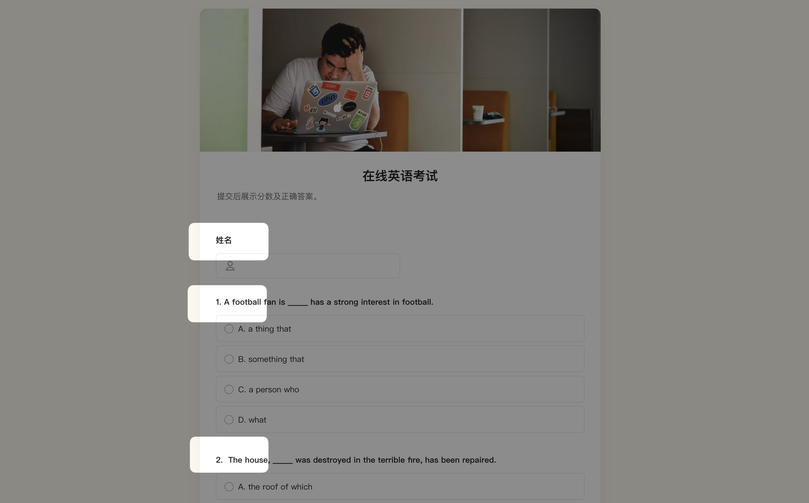

# 🧩 金数据产品每周更新 The Builder - 第17期

## 🎉 上周功能更新

### 🎬 在数据页面，可以直接预览视频格式的附件内容了

金数据表单可以收集图片、视频文件。例如在比赛报名、年会素材收集等场景中，你可以使用「收集附件」并限定上传格式是图片或者视频。

在金数据的数据列表、数据详情页面，除了图片文件，你现在也可以直接预览视频文件了。这个功能可以提升表单管理员的工作效率，无需在下载文件，就可以直接查看数据中的视频内容了。

[点击这里](https://jinshuju.net/help/articles/upload-file) 查看更多金数据收集附件字段的文档。

### 📱 优化了日期字段和时间字段，在移动端交互的样式

金数据支持日期、时间类型的数据收集。你可以限定填表人填写「年-月-日」，也可以限定到具体的「年-月-日-时-分-秒」。对于有些业务场景，你可以限定只填写「时-分-秒」。

无论是「日期」还是「时间」，我们已经优化了在移动端的交互，填表人可以更快速更准确的选择正确的结果。

### 💯 非考试题目，不参与考试表单的自动排号

金数据的在线考试功能非常强大，你可以很轻松的创建一个在线考试业务。对于表单上面的所有题目和字段，你可以设置系统自动生成「1、2、3...」的编号。

在考试的场景中，有些非考试题目的字段，例如「姓名」、「学号」、「班级」等，不会参与自动序号，避免考试题目序号出现偏差。

## 🎁 功能优化

* 在回收站中彻底删除表单，可以控制权限并且查看操作日志记录了。
* 优化了编辑器中修改「反向关联」的错误提示。
* 表单管理员可以在编辑器中快速开启/关闭「自动字段序号」了。
