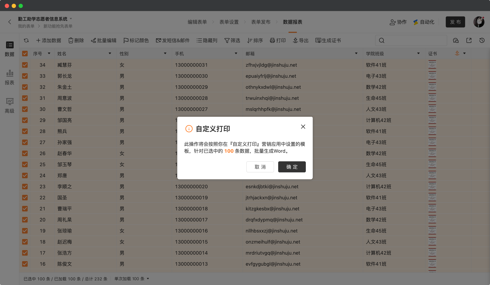
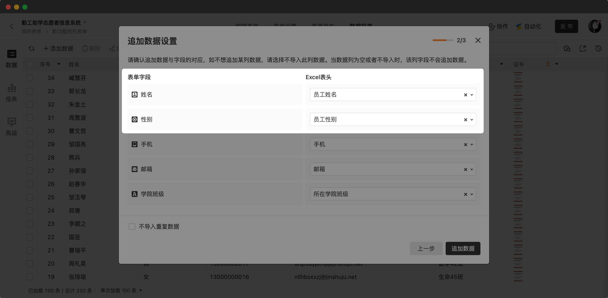
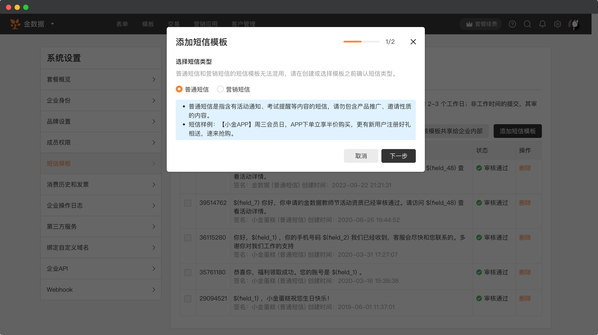
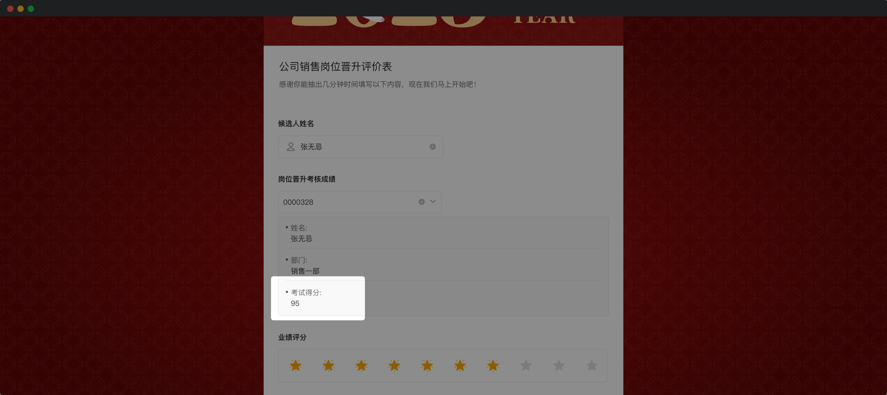

# 🧩 金数据产品每周更新 The Builder - 第19期

## 🎉 上周功能更新

### 🖨 数据页面支持按照「自定义打印」进行批量导出了

金数据表单支持「自定义打印」功能。你可以通过 Word 创建一个自定义模板，将表单的字段作为占位符插入到模板中。自定义打印功能可以用于「准考证生成」「数据归档」等业务场景。

现在「自定义打印」支持数据批量打印了，你可以一次打印选中的多条数据。这个功能会极大的提升表单管理员的工作效率。

[点击这里](https://jinshuju.net/help/articles/customized-print) 查看更多金数据自定义打印的文档。

### 👉 Excel 导入数据时，可以手工匹配表单字段和 Excel 表头的对应关系了

金数据支持通过 Excel 直接创建一个带有数据的表单，也支持通过 Excel 向一个表单追加数据。

在导入数据时，现在你可以手工的匹配表单字段和 Excel 表头的对应关系了。例如，表单中的字段叫做「姓名」、「性别」，但是同事给你的 Excel 表头确实「学生姓名」、「学生性别」，这种情况你无需修改和重新上传 Excel，可以直接在导入时制定对应关系，提升了 Excel 导入的效率。

[点击这里](https://jinshuju.net/help/articles/data-excel) 查看更多金数据的 Excel 导入导出。

### ✉️ 可以在系统设置中提前创建短信模板并提交审核了

金数据的短信模块是消息通知、营销运营的重要功能。现在你可以在表单创建之前，在系统设置中，提前创建短信模板并提交审核了。这有利于你在活动之前，提前准备好短信模板并通过审核，确保不会因为短信审核耽误了表单的投放和运营活动。

[点击这里](https://jinshuju.net/help/articles/sms) 查看更多金数据的短信功能。

### 🔗 表单关联支持展示考试场景的考试得分信息了

表单关联是金数据多表引用数据的一个重要功能，你可以通过表单关联，在业务表上引用其他表单的数据，将其他表单的一些字段展示在当前的业务表上。

我们优化了表单关联，让其可以支持更多的系统字段。例如，在一个晋升评价表中，你可以关联候选人之前的考核表成绩，以便于评价人进行打分。

[点击这里](https://jinshuju.net/help/articles/form-association) 查看更多金数据的表单关联功能。

## 🎁 功能优化

* 调整了系统设置成员列表、邀请成员加入的文案。
* 优化了系统后台发票申请交互和流程，提升了申请发票效率。
* 优化了开启「取消预约」功能的入口。

