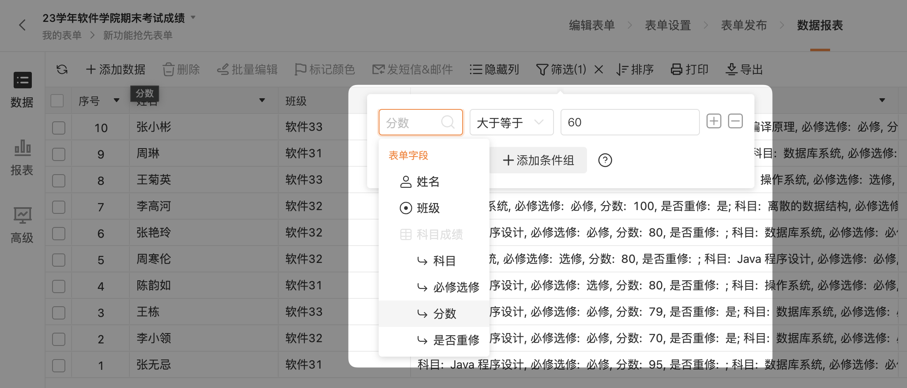

# 🧩 金数据产品每周更新 The Builder - 第20期

年过完了，开工大吉！

## 🎉 上周功能更新

### 🖨 Excel 导入数据时，可以选择不导入重复的数据

除了通过填写表单收集数据，还有很多用户使用 Excel 格式将现有的数据导入到金数据的表单中。有些场景，Excel 的数据可能来自不同的部门、渠道，需要在导入时对数据进行一定的校验和清洗。

现在你可以在导入时，选择「不导入重复的数据」。你可以根据「手机」、「姓名」、「邮箱」等字段进行自动检查，过滤掉已经存在的数据。这个功能可以避免重复数据影响业务，提升工作效率。

[点击这里](https://jinshuju.net/help/articles/data-excel) 查看更多金数据 Excel 导入导出的功能。

### 🖨 可以根据表格字段的单个项目进行数据过滤、权限设置

对于已经收集到的数据，后续的管理和协作也是金数据重要的一个能力。金数据的表格字段、矩阵填空字段，有助于简单高效的收集复杂结构的数据，例如「考试科目成绩」、「家庭关系」、「工作经历」等数据。现在，你可以针对表格、矩阵中的单个项目进行数据的查询过滤了。例如，你可以搜索考试任意科目成绩大于 60 分的，或者根据家庭关系的手机号进行查询。

处理对数据进行查询外，你也可以利用表格、矩阵字段来配置协作权限、查询权限。

## 🎁 功能优化

* 在表单桌面列表上，你可以快速的复制表单的发布链接了。
* 优化了手机字段的样式。
* 修复了计算字段被字段规则隐藏后的计算逻辑。
* 优化「红包」&「大转盘」应用样式。
* 开启「禁止在微信中分享」，红包领取页面也不能在微信中分享。
* 修复了考试限时答题在表单停止收集数据时间后无法提交的问题。

## 💡 The Idea

> 并非所有时间都是平等的。

一个普遍的谬论是，所有时间都是平等的。每个人每天都只有 24 个小时。实际上，如何花费你的时间会有很大的影响，有些时间比其他的时间更重要。你可以更好的决定时间的优先次序，将其分配给对你最重要的事情。

## 🔑 The Tool

本期分享的是一个腾讯出品的工具集合「帮小忙」： https://tool.browser.qq.com

帮小忙是一个功能俱全、简单好用的线上工具集合。

---

__[点击这里免费注册金数据](https://jinshuju.net/?utm_campaign=the_builder&utm_medium=social&utm_source=github)，搭建你的业务数据收集管理系统！__

__扫码关注《金数据 The Builder》，每周第一时间得知金数据产品更新，以及有趣的想法和工具。__

The Builder

Cheers，下周见

2023年02月06日 成都&西安
