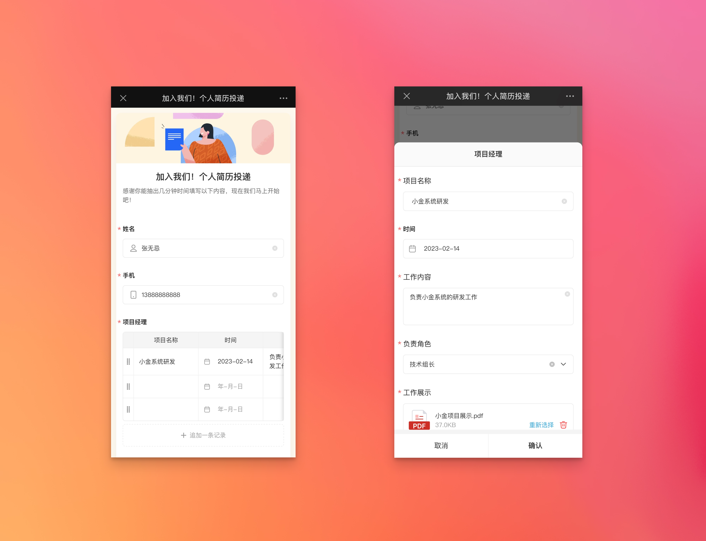
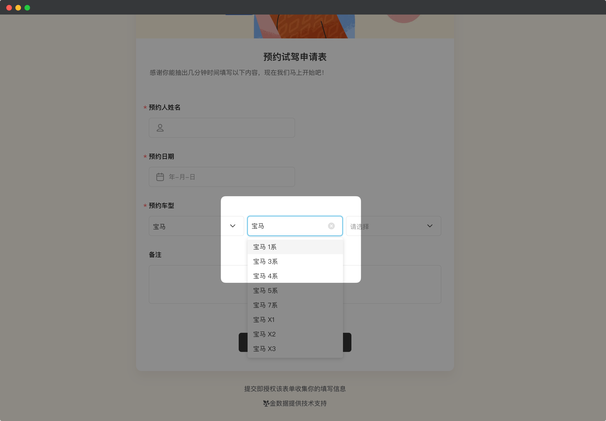
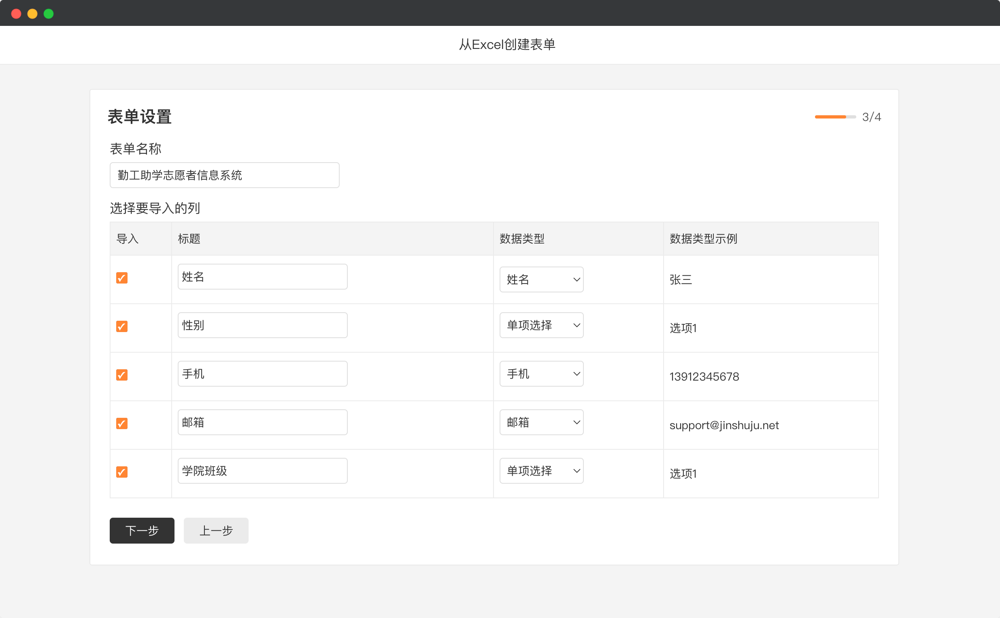

# 🧩 金数据产品每周更新 The Builder - 第21期

## 🎉 上周功能更新

### 📱 矩阵和表格字段，在移动端填写时的交互更新

金数据表单可以收集复杂结构的数据，例如矩阵填空、表格字段。你可以用在应聘者填写过往项目经历、收集学生家庭联系人等业务场景中。这些表格的每一列，都是一个单独的字段，比如项目名称、项目类型、上传项目证书等。

对于这些复杂字段，填表人在移动端上有了更好的填写体验。如图所示，矩阵和表格字段的每一行，在填写时都有了和主表单一致的交互体验。

__注意，这个功能正逐步开放给所有用户。如果你想体验，请联系客户成功经理。__

[点击这里](https://jinshuju.net/help/articles/chart) 查看更多金数据表格字段的文档。

### 🔍 下拉框、多级下拉框、地址、表单关联，支持在填写时搜索选项

金数据提供了多种选项类型的字段，例如下拉框、多级下拉框、地址，还有表单关联用于跨表选择数据。在矩阵和表格字段中，也支持下拉框、多级下拉框项目。

对于这些字段，填表人在填写表单时都可以搜索选项了。当你的表单字段选项数量较多时，这个功能可以提升填写人的填写效率。

### 🗂 Excel 导入数据时，会自动根据列名识别字段类型

你可以通过上传已有的 Excel 创建表单和数据。当你在上传 Excel 时，现在系统可以更好的根据列名来判定对应的金数据字段类型了。例如，学生姓名会自动创建「姓名字段」，联系人手机会自动创建「手机字段」。

[点击这里](https://jinshuju.net/help/articles/data-excel) 查看更多金数据Excel导入导出的文档。

## 🎁 功能优化

* 提升了包含客户群组信息的表单的 Excel 导出速度。
* 优化了「在网页嵌入表单」时，在移动端上的样式和交互。
* 优化了「微信中填表后允许填表人修改」的配置交互。
* 优化了在数据页面， Excel 导出任务的信息提示。
* 优化了表单编辑器中，下拉框和多级下拉框的设置文案。
* 修复了当随机出题数量大于表单题目数量时的编辑问题。
* 修复了在数据页面批量编辑无法使用新增字段的问题。

## 💡 The Idea

> 更多的时间不等于更高的生产力

有些情况下，增加时间看起来可以增大生产力，进而带来更多产出。但实际上，给一份工作更多的时间，不一定可以带来更好的结果。影响工作结果更为关键的因素是工作意愿和工作能力。而且根据帕金森定理，在工作能够完成的时限内，工作量会一直增加，直到所有可用时间都被填充为止。

## 🔑 The Tool

本期分享的是一个可视化展示大金字塔的网站： https://giza.mused.org

这个网站的交互非常不错，展示了大金字塔的内部，并且支持中文。

---

__[点击这里免费注册金数据](https://jinshuju.net/?utm_campaign=the_builder&utm_medium=social&utm_source=github)，搭建你的业务数据收集管理系统！__

__扫码关注《金数据 The Builder》，每周第一时间得知金数据产品更新，以及有趣的想法和工具。__

The Builder

Cheers，下周见

2023年02月13日 成都&西安
