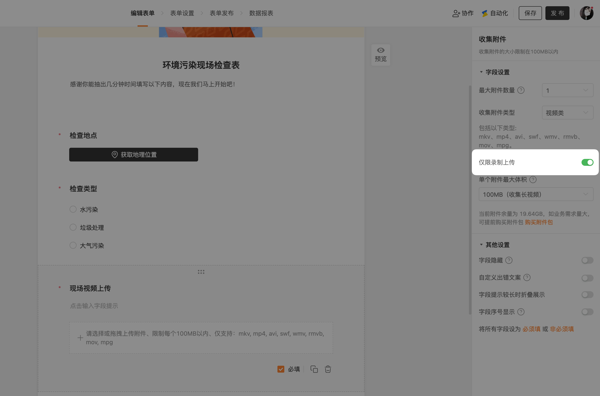
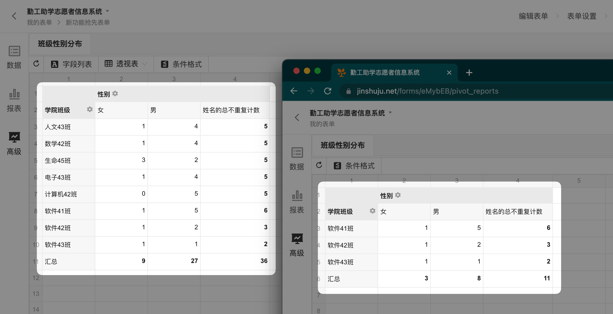

# 🧩 金数据产品每周更新 The Builder - 第22期

## 🎉 上周功能更新

### 🎥 表单支持仅限现场录制上传视频，以便于收集现场情况

有些表单需要收集现场视频信息，例如质量检查、巡检、现场问题上报等。金数据表单的「收集附件」字段允许填表人上传视频。现在，表单管理员可以限制只允许现场录制上传视频了。这样子可以保证数据的有效性。配合金数据表单「地理信息」字段，也可以保证现场位置的有效性。

[点击这里](https://jinshuju.net/help/articles/upload-file) 查看更多金数据收集图片和视频的功能说明。

### 📊 表单协作的自定义角色，也可以使用高级报表了

金数据的高级报表，提供了数据管理员根据字段自定义透视表、柱状图等功能。同时，金数据表单协作也提供了自定义权限角色，你可以根据业务需要，限制协作者只能看到部分列数据，或者部分行数据。

例如，学生活动报名表，你可以配置一个角色，只能查看某个学院的学生数据。

当自定义权限的协作者查看表单数据的高级报表时，他也可以使用高级报表的所有功能，同时他也只能看到自己权限范围内的数据统计。

[点击这里](https://jinshuju.net/help/articles/advancedreporting) 查看更多金数据高级报表的功能说明。

### 🔍 通过表单关联查询数据时，会以选项的形式提供选择

表单关联可以在金数据表单中直接引用另一个表单的数据。例如你可以在员工请假记录表中引用员工信息表的信息，也就是员工每次请假时，无需重复录入自己的姓名、部门，而是可以自动从员工信息表中获取。

当你希望通过关联表单在数据上做查询时，比如希望通过员工姓名来查询员工的请假记录，现在查询搜索框，会将所有关联的员工姓名用下拉搜索框的形式展示。放心，你也不必担心数据太多的问题，这里的下拉框提供了搜索功能，可以通过输入快速找到你希望查询的关联数据。

[点击这里](https://jinshuju.net/help/articles/form-association) 查看更多金数据表单关联的功能说明。

## 🎁 功能优化

* 优化了考试场景的填写时长，解决了跨天重复考试的问题。
* 优化了系统中「插入字段」的样式，避免了字段标题过长时显示不全的问题。
* 在数据页面有筛选条件时，菜单栏有更醒目的提示。
* 修复了钉钉版本，无法通过子部门筛选提交数据的问题。

## 💡 The Idea

## 🔑 The Tool
