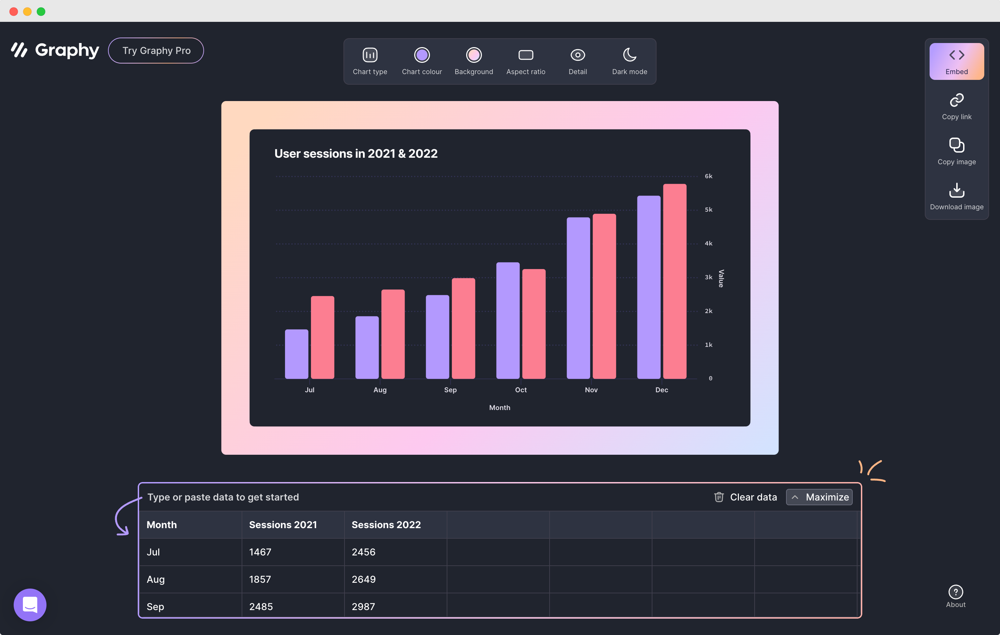

# 🧩 金数据产品每周更新 The Builder - 第22期

## 🎉 上周功能更新

### 🎥 表单支持仅限上传现场录制视频，以便于收集现场情况

有些表单需要收集现场视频，例如质检、巡检、现场问题上报等。金数据表单的「收集附件」字段允许填表人上传视频。现在，表单管理员可以限制只允许上传现场录制视频了。这样子就可以保证数据的有效性。同时，配合「地理信息」字段，还可以保证提交位置的有效性。

[点击这里](https://jinshuju.net/help/articles/upload-file) 查看更多金数据收集图片视频的功能说明。

### 📊 自定义权限的表单协作者，也可以使用高级报表了

表单管理员可以通过金数据的高级报表，来自定义搭建数据透视表、交叉分析柱状图等功能。同时，金数据表单协作也提供了自定义权限。你可以根据业务需要，限制协作者只能看到部分列数据，或者部分行数据。

例如，一个学生活动报名表，你可以配置一个角色，只能查看单个学院的学生数据。

当自定义权限的协作者查看高级报表时，他可以使用高级报表的所有功能，同时他也只能看到自己权限范围内的数据和统计结果。

[点击这里](https://jinshuju.net/help/articles/advancedreporting) 查看更多金数据高级报表的功能说明。

### 🔍 通过表单关联查询数据时，数据会以选项的形式提供选择

通过表单关联，你可以在金数据表单中引用另一个表单的数据。例如你可以在员工请假记录表中引用员工信息表的信息。这样子当员工每次请假时，就无需重复录入自己的姓名、部门，而可以自动从员工信息表中获取。

当你通过关联表单做数据查询时，现在查询搜索框，会将所有关联的数据用下拉搜索框的形式展示。放心，你不必担心数据太多的问题，这里的下拉框提供了搜索功能，填表人可以快速找到所需要的关联数据。

[点击这里](https://jinshuju.net/help/articles/form-association) 查看更多金数据表单关联的功能说明。

## 🎁 功能优化

* 优化了考试场景的填写时长信息，解决了跨天重复考试的问题。
* 优化了系统中「插入字段」的样式，避免了字段标题过长时显示不全的问题。
* 在数据页面有筛选条件时，菜单栏上有更醒目的提示。
* 修复了金数据钉钉版本，无法通过子部门筛选提交数据的问题。

## 💡 The Idea

> Focus is about saying no. Anyone can say no to bad ideas, but only a focused person can say no to good ideas.

任何人都可以对坏主意说不，但只有专注的人可以对好主意说不。

（本期 The Idea 由 周小虫 同学提供）

## 🔑 The Tool

本期分享的是一个简单易用的图表分享工具： https://graphy.new

在 Graphy.new 上，你只需要将你的数据复制粘贴上去，就可以快速生成各种样式的图表，并且可以分享出去。

---

__[点击这里免费注册金数据](https://jinshuju.net/?utm_campaign=the_builder&utm_medium=social&utm_source=github)，搭建你的业务数据收集管理系统！__

__扫码关注《金数据 The Builder》，每周第一时间得知金数据产品更新，以及有趣的想法和工具。__

The Builder

Cheers，下周见

2023年02月20日 成都&西安
