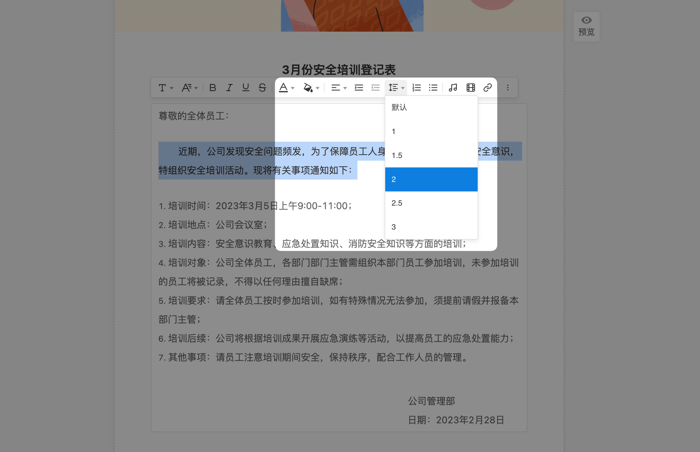
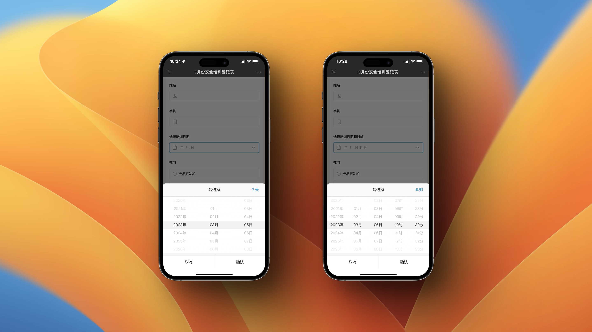
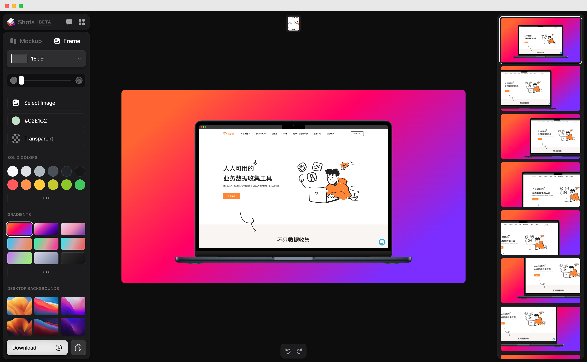

# 🧩 金数据产品每周更新 The Builder - 第23期

## 🎉 上周功能更新

### 📝 表单和字段的描述支持设置行间距，以便让内容格式更美观

很多表单都附带有营销、通知、培训的场景，需要在描述中添加富文本说明。在表单编辑器中，你可以给表单的描述、字段的描述文本设置行间距了。通过合理的行间距，你可以让文字突出重点更加可读，以便于填表人更好的理解表单并填写数据。

[点击这里](https://jinshuju.net/help/articles/description) 查看更多金数据描述字段的功能。

### 📆 优化了日期选择在移动端的交互

日期字段支持选择「年-月-日」、「年月日-时分」等多种格式。我们优化了日期选择在移动端的交互，保持了和其他选择类字段的风格统一。填表人可以在移动端上快速选择「今天」或者「此刻」。你也可以在编辑器中设置默认值为「当前时刻」或者「指定日期」。

## 🎁 功能优化

* 优化了下拉框、多级下拉框的设置，当选项较多时，自动展示搜索选项框。
* 当表单包含较多「地图导航」组件时，优化了表单打开速度。
* 优化了数据页面、对外表单一些样式和交互问题。

## 💡 The Idea

> SMART 目标设定方法

在设定目标时，可以使用 SMART 方法。即你的目标需要符合一下几点：

1. Specific 目标必须是具体的、清晰的。
2. Measurable 目标是否完成必须是可以衡量的。（比如数量、收入）
3. Achievable 目标必须是可以达成的。（可行性）
4. Relevant 目标必须是相关的。（与大目标匹配、合适的时间和人）
5. Time bound 目标必须是有时间限制的。（必须有一个明确的时间检查点）

## 🔑 The Tool

本期分享的是一个很漂亮的制作 Mockups 的工具： https://shots.so/

通过 shots.so，你可以很方便的给你的网站、产品、App 制作美观的 Mockups 图片。例如，本期周报中，「日期选择在移动端的交互」就是通过 shots.so 制作的。

---

__[点击这里免费注册金数据](https://jinshuju.net/?utm_campaign=the_builder&utm_medium=social&utm_source=github)，搭建你的业务数据收集管理系统！__

__扫码关注《金数据 The Builder》，每周第一时间得知金数据产品更新，以及有趣的想法和工具。__

The Builder

Cheers，下周见

2023年02月20日 成都&西安
